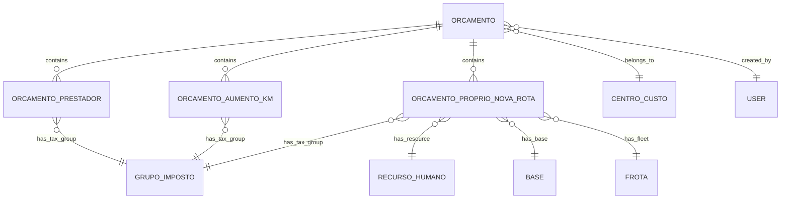

# Análise Técnica - Funcionalidade de Orçamentos (App Antigo)

## 1. VISÃO GERAL DA FUNCIONALIDADE

### Objetivo Principal

A funcionalidade de orçamentos é o coração do sistema OBM, permitindo a criação, cálculo e gestão de orçamentos para serviços de transporte. O sistema suporta diferentes tipos de orçamentos com cálculos automáticos de custos, impostos e lucros.

### Tipos de Orçamentos Suportados

1. **Prestador**: Orçamentos terceirizados com fornecedores externos
2. **Aumento de KM**: Orçamentos com cálculos adicionais de quilometragem, combustível e pedágios
3. **Próprio Nova Rota**: Orçamentos com recursos próprios e novas rotas

### Fluxo Geral do Processo

```
Solicitação → Criação → Cálculos → Aprovação → Exportação PDF
```

## 2. ARQUITETURA E ESTRUTURA

### Modelos de Dados Principais

#### **Orcamento Model** (`app/Models/Orcamento.php`)

```php
// Campos principais
- data_solicitacao: Data da solicitação
- centro_custo_id: Centro de custo vinculado
- numero_orcamento: Número único gerado automaticamente
- nome_rota: Nome da rota
- id_logcare: ID LogCare
- cliente_omie_id: ID do cliente Omie
- cliente_nome: Nome do cliente
- horario: Horário do serviço
- frequencia_atendimento: Frequência (Diário, Semanal, Mensal)
- tipo_orcamento: Tipo (prestador, aumento_km, proprio_nova_rota)
- user_id: Usuário criador
- data_orcamento: Data do orçamento
- valor_total: Valor total
- valor_impostos: Valor dos impostos
- valor_final: Valor final
- status: Status (pendente, aprovado, reprovado, cancelado)
```

#### **OrcamentoPrestador Model** (`app/Models/OrcamentoPrestador.php`)

```php
// Campos específicos para orçamentos de prestador
- orcamento_id: ID do orçamento principal
- fornecedor_omie_id: ID do fornecedor Omie
- fornecedor_nome: Nome do fornecedor
- valor_referencia: Valor de referência
- qtd_dias: Quantidade de dias
- custo_fornecedor: Custo do fornecedor
- lucro_percentual: Percentual de lucro
- valor_lucro: Valor do lucro
- impostos_percentual: Percentual de impostos
- valor_impostos: Valor dos impostos
- valor_total: Valor total
```

#### **OrcamentoAumentoKm Model** (`app/Models/OrcamentoAumentoKm.php`)

```php
// Campos para aumento de KM
- orcamento_id: ID do orçamento principal
- km_rodado_mensal: KM rodado mensal
- km_rodado_adicional: KM adicional
- consumo_combustivel: Consumo de combustível
- valor_combustivel: Valor do combustível
- hora_extra: Horas extras
- valor_hora_extra: Valor da hora extra
- pedagio: Valor de pedágio
- grupo_imposto_id: ID do grupo de impostos
```

#### **OrcamentoProprioNovaRota Model** (`app/Models/OrcamentoProprioNovaRota.php`)

```php
// Campos complexos para orçamento próprio com nova rota
- orcamento_id: ID do orçamento principal
- origem: Origem da rota
- destino: Destino da rota
- km_ida_volta: KM ida e volta
- valor_km: Valor por KM
- recurso_humano_id: ID do recurso humano
- funcao: Função do recurso
- base_id: ID da base
- valor_recurso_humano: Valor do recurso humano
- frota_id: ID da frota
- valor_locacao_frota: Valor de locação da frota
- fornecedor_id: ID do fornecedor
- fornecedor_nome: Nome do fornecedor
- valor_referencia_fornecedor: Valor de referência
- qtd_dias_fornecedor: Dias do fornecedor
- custo_fornecedor: Custo do fornecedor
- lucro_percentual_fornecedor: Lucro percentual
- valor_lucro_fornecedor: Valor do lucro
- impostos_percentual_fornecedor: Percentual de impostos
- valor_impostos_fornecedor: Valor dos impostos
- valor_total_fornecedor: Valor total do fornecedor
```

### Relacionamentos entre Tabelas



### Estrutura de Migrations

#### **orcamentos table** (`2025_08_22_081248_create_orcamentos_table.php`)

```php
Schema::create('orcamentos', function (Blueprint $table) {
    $table->id();
    $table->date('data_solicitacao');
    $table->foreignId('centro_custo_id')->constrained('centros_custo');
    $table->string('numero_orcamento')->unique();
    $table->string('nome_rota')->nullable();
    $table->string('id_logcare')->nullable();
    $table->string('cliente_omie_id')->nullable();
    $table->string('cliente_nome')->nullable();
    $table->string('horario')->nullable();
    $table->string('frequencia_atendimento')->nullable();
    $table->string('tipo_orcamento'); // prestador, aumento_km, proprio_nova_rota
    $table->foreignId('user_id')->constrained('users');
    $table->date('data_orcamento')->nullable();
    $table->decimal('valor_total', 10, 2)->default(0);
    $table->decimal('valor_impostos', 10, 2)->default(0);
    $table->decimal('valor_final', 10, 2)->default(0);
    $table->string('status')->default('pendente');
    $table->text('observacoes')->nullable();
    $table->timestamps();
    
    $table->index('status');
    $table->index('tipo_orcamento');
    $table->index('data_solicitacao');
});
```

### Serviços e suas Responsabilidades

#### **OrcamentoService** (`app/Services/Orcamentos/OrcamentoService.php`)

* **Responsabilidade Principal**: Orquestrar todas as operações de orçamentos

* **Métodos Principais**:

  * `listarOrcamentos()`: Lista com filtros e paginação

  * `buscarOrcamentos()`: Busca avançada com cache

  * `criarOrcamento()`: Criação com transação

  * `visualizarOrcamento()`: Visualização completa com relacionamentos

  * `atualizarOrcamento()`: Atualização com regras de negócio

  * `excluirOrcamento()`: Exclusão com validações

  * `duplicarOrcamento()`: Duplicação com todos os dados

  * `atualizarStatus()`: Atualização de status com validações

  * `gerarPdf()`: Geração de PDF com template

  * `dadosDashboard()`: Dados para dashboard

  * `dadosFormulario()`: Dados para formulários (centros de custo, grupos de impostos, bases)

  * `getRecursosHumanos()`: Recursos humanos disponíveis

  * `getFrotas()`: Frotas disponíveis

  * `buscarFornecedoresOmie()`: Busca fornecedores na API Omie

  * `buscarClientesOmie()`: Busca clientes na API Omie

#### **Serviços Especializados**:

* **CacheService**: Gerenciamento de cache com TTL configurável

* **CalculatorService**: Cálculos complexos de valores

* **ValidationService**: Validações de negócio

* **SearchService**: Busca e filtros avançados

* **PdfService**: Geração de PDFs

* **ReportService**: Relatórios e exportações

## 3. TIPOS DE ORÇAMENTOS - DETALHAMENTO

### 3.1 ORÇAMENTO PRESTADOR

#### Características

* Utiliza fornecedores externos cadastrados na Omie

* Cálculo baseado em valor de referência e quantidade de dias

* Aplicação de lucro e impostos sobre o custo do fornecedor

#### Campos Específicos

```php
- fornecedor_omie_id: ID do fornecedor na Omie
- fornecedor_nome: Nome do fornecedor
- valor_referencia: Valor de referência por dia
- qtd_dias: Quantidade de dias do serviço
- custo_fornecedor: Custo total do fornecedor
- lucro_percentual: Percentual de lucro desejado
- impostos_percentual: Percentual de impostos
```

#### Cálculos Automáticos

```php
// No método calculate() do model
$custo_fornecedor = $valor_referencia * $qtd_dias;
$valor_lucro = $custo_fornecedor * ($lucro_percentual / 100);
$valor_impostos = ($custo_fornecedor + $valor_lucro) * ($impostos_percentual / 100);
$valor_total = $custo_fornecedor + $valor_lucro + $valor_impostos;
```

### 3.2 ORÇAMENTO AUMENTO DE KM

#### Características

* Cálculo adicional sobre orçamentos existentes

* Considera quilometragem extra, combustível, horas extras e pedágios

* Usa grupos de impostos configuráveis

#### Campos Específicos

```php
- km_rodado_mensal: KM rodado no mês
- km_rodado_adicional: KM adicional necessário
- consumo_combustivel: Consumo em km/l
- valor_combustivel: Valor por litro do combustível
- hora_extra: Quantidade de horas extras
- valor_hora_extra: Valor por hora extra
- pedagio: Valor total de pedágios
- grupo_imposto_id: ID do grupo de impostos
```

#### Cálculos Automáticos

```php
// Cálculo de combustível
$litros_combustivel = $km_rodado_adicional / $consumo_combustivel;
$valor_total_combustivel = $litros_combustivel * $valor_combustivel;

// Cálculo de horas extras
$valor_total_hora_extra = $hora_extra * $valor_hora_extra;

// Cálculo com impostos
$subtotal = $valor_total_combustivel + $valor_total_hora_extra + $pedagio;
$valor_impostos = $subtotal * ($percentual_imposto / 100);
$valor_total = $subtotal + $valor_impostos;
```

### 3.3 ORÇAMENTO PRÓPRIO NOVA ROTA

#### Características

* Mais complexo dos três tipos

* Combina recursos próprios (recursos humanos, frotas) com fornecedores

* Cálculo detalhado por componentes (rota, RH, frota, fornecedor)

#### Campos Específicos por Componente

**Componente Rota:**

```php
- origem: Local de origem
- destino: Local de destino
- km_ida_volta: Total de KM
- valor_km: Valor por KM
```

**Componente Recurso Humano:**

```php
- recurso_humano_id: ID do recurso humano
- funcao: Função/cargo
- base_id: ID da base
- valor_recurso_humano: Valor do RH por dia
```

**Componente Frota:**

```php
- frota_id: ID da frota
- valor_locacao_frota: Valor de locação por dia
```

**Componente Fornecedor (opcional):**

```php
- fornecedor_id: ID do fornecedor
- fornecedor_nome: Nome do fornecedor
- valor_referencia_fornecedor: Valor de referência
- qtd_dias_fornecedor: Quantidade de dias
- lucro_percentual_fornecedor: Percentual de lucro
- impostos_percentual_fornecedor: Percentual de impostos
```

#### Cálculos Automáticos Complexos

```php
// Valor da rota
$valor_total_rota = $km_ida_volta * $valor_km;

// Valor do recurso humano (calculado com base na frequência)
$dias = $this->calcularDiasPorFrequencia($frequencia);
$valor_total_rh = $valor_recurso_humano * $dias;

// Valor da frota
$valor_total_frota = $valor_locacao_frota * $dias;

// Valor do fornecedor (se houver)
$custo_fornecedor = $valor_referencia_fornecedor * $qtd_dias_fornecedor;
$valor_lucro_fornecedor = $custo_fornecedor * ($lucro_percentual_fornecedor / 100);
$valor_impostos_fornecedor = ($custo_fornecedor + $valor_lucro_fornecedor) * ($impostos_percentual_fornecedor / 100);
$valor_total_fornecedor = $custo_fornecedor + $valor_lucro_fornecedor + $valor_impostos_fornecedor;

// Total geral
$valor_geral = $valor_total_rota + $valor_total_rh + $valor_total_frota + $valor_total_fornecedor;
```

## 4. SISTEMA DE CÁLCULOS

### 4.1 Calculators Directory (`app/Services/Orcamentos/Calculators/`)

#### **BaseCalculator.php**

* Classe abstrata com métodos comuns

* Define interface para todos os calculadores

* Gerenciamento de contexto e configurações

#### **PrestadorCalculator.php**

```php
public function calculate(array $data): array
{
    $custoFornecedor = $data['valor_referencia'] * $data['qtd_dias'];
    $valorLucro = $custoFornecedor * ($data['lucro_percentual'] / 100);
    $valorImpostos = ($custoFornecedor + $valorLucro) * ($data['impostos_percentual'] / 100);
    $valorTotal = $custoFornecedor + $valorLucro + $valorImpostos;
    
    return [
        'custo_fornecedor' => $custoFornecedor,
        'valor_lucro' => $valorLucro,
        'valor_impostos' => $valorImpostos,
        'valor_total' => $valorTotal
    ];
}
```

#### **AumentoKmCalculator.php**

```php
public function calculate(array $data): array
{
    $litrosCombustivel = $data['km_rodado_adicional'] / $data['consumo_combustivel'];
    $valorCombustivel = $litrosCombustivel * $data['valor_combustivel'];
    $valorHoraExtra = $data['hora_extra'] * $data['valor_hora_extra'];
    $subtotal = $valorCombustivel + $valorHoraExtra + $data['pedagio'];
    
    // Aplicar impostos do grupo
    $grupoImposto = GrupoImposto::find($data['grupo_imposto_id']);
    $percentualImposto = $grupoImposto->percentual_total ?? 0;
    $valorImpostos = $subtotal * ($percentualImposto / 100);
    $valorTotal = $subtotal + $valorImpostos;
    
    return [
        'valor_combustivel_calculado' => $valorCombustivel,
        'valor_hora_extra_calculado' => $valorHoraExtra,
        'valor_subtotal' => $subtotal,
        'valor_impostos' => $valorImpostos,
        'valor_total' => $valorTotal,
        'percentual_imposto' => $percentualImposto
    ];
}
```

#### **ProprioNovaRotaCalculator.php**

```php
public function calculate(array $data): array
{
    // Cálculo da rota
    $valorTotalRota = $data['km_ida_volta'] * $data['valor_km'];
    
    // Cálculo dos dias baseado na frequência
    $dias = $this->calcularDiasPorFrequencia($data['frequencia_atendimento']);
    
    // Cálculo do recurso humano
    $valorTotalRH = $data['valor_recurso_humano'] * $dias;
    
    // Cálculo da frota
    $valorTotalFrota = $data['valor_locacao_frota'] * $dias;
    
    // Cálculo do fornecedor (se houver)
    $valorTotalFornecedor = 0;
    if (!empty($data['fornecedor_id'])) {
        $custoFornecedor = $data['valor_referencia_fornecedor'] * $data['qtd_dias_fornecedor'];
        $valorLucroFornecedor = $custoFornecedor * ($data['lucro_percentual_fornecedor'] / 100);
        $valorImpostosFornecedor = ($custoFornecedor + $valorLucroFornecedor) * ($data['impostos_percentual_fornecedor'] / 100);
        $valorTotalFornecedor = $custoFornecedor + $valorLucroFornecedor + $valorImpostosFornecedor;
    }
    
    // Total geral
    $valorGeral = $valorTotalRota + $valorTotalRH + $valorTotalFrota + $valorTotalFornecedor;
    
    return [
        'valor_total_rota' => $valorTotalRota,
        'valor_total_recurso_humano' => $valorTotalRH,
        'valor_total_frota' => $valorTotalFrota,
        'valor_total_fornecedor' => $valorTotalFornecedor,
        'valor_geral' => $valorGeral,
        'dias_calculados' => $dias
    ];
}
```

### 4.2 Grupos de Impostos

#### Model **GrupoImposto**

```php
- nome: Nome do grupo
- percentual_total: Percentual total de impostos
- descricao: Descrição detalhada
- ativo: Status ativo/inativo
```

#### Cálculo de Impostos por Grupo

Os grupos de impostos são aplicados diferentemente para cada tipo:

* **Prestador**: Impostos sobre (custo + lucro)

* **Aumento KM**: Impostos sobre subtotal

* **Próprio Nova Rota**: Impostos específicos por componente

## 5. INTEGRAÇÕES

### 5.1 Integração Omie

#### **OmieService** integrado no OrcamentoService

```php
// Busca de fornecedores
public function buscarFornecedoresOmie(string $cnpj = null, string $nome = null)
{
    $cacheKey = "omie_fornecedores_{$cnpj}_{$nome}";
    return Cache::remember($cacheKey, self::CACHE_OMIE_TTL, function () use ($cnpj, $nome) {
        // Chamada API Omie para listar fornecedores
        return $this->omieService->listarFornecedores($cnpj, $nome);
    });
}

// Busca de clientes
public function buscarClientesOmie(string $cnpj = null, string $nome = null)
{
    $cacheKey = "omie_clientes_{$cnpj}_{$nome}";
    return Cache::remember($cacheKey, self::CACHE_OMIE_TTL, function () use ($cnpj, $nome) {
        // Chamada API Omie para listar clientes
        return $this->omieService->listarClientes($cnpj, $nome);
    });
}
```

#### Armazenamento Local de Dados Omie

```php
// Nos models, os campos Omie são armazenados localmente
- cliente_omie_id: ID do cliente na Omie
- cliente_nome: Nome do cliente (cache local)
- fornecedor_omie_id: ID do fornecedor na Omie
- fornecedor_nome: Nome do fornecedor (cache local)
```

### 5.2 Centros de Custo

#### Model **CentroCusto**

```php
- codigo: Código único
- nome: Nome do centro de custo
- descricao: Descrição
- ativo: Status
- orcamentos(): Relacionamento com orçamentos
```

#### Integração nos Orçamentos

* Cada orçamento deve estar vinculado a um centro de custo

* Usado para controle financeiro e relatórios

* Filtro importante na listagem

### 5.3 Bases e Frotas

#### Model **Base**

```php
- nome: Nome da base
- endereco: Endereço completo
- ativo: Status
- orcamentosProprioNovaRota(): Relacionamento
```

#### Model **Frota**

```php
- placa: Placa do veículo
- modelo: Modelo do veículo
- tipo: Tipo de frota
- capacidade: Capacidade
- valor_locacao_diaria: Valor de locação
- ativo: Status
```

#### Model **RecursoHumano**

```php
- nome: Nome do recurso
- funcao: Função/cargo
- valor_diaria: Valor da diária
- base_id: Base vinculada
- ativo: Status
```

### 5.4 Usuários e Permissões

#### Controle de Acesso

* Criação: Apenas usuários autenticados

* Edição: Criador ou usuários com permissão

* Visualização: Usuários com permissão no centro de custo

* Exclusão: Apenas administradores ou criadores

* Status: Transições controladas por permissões

## 6. INTERFACE E USABILIDADE

### 6.1 Estrutura de Views

#### **index.blade.php** (Listagem Principal)

```blade
@include('components.orcamentos.header')
@include('components.orcamentos.filters')
@include('components.orcamentos.table')
@include('components.orcamentos.pagination')
@include('components.orcamentos.modal-delete')
```

#### **Components Structure** (`resources/views/components/orcamentos/`)

* **header.blade.php**: Título, botões de ação, status

* **filters.blade.php**: Filtros por tipo, status, período, cliente

* **table.blade.php**: Tabela com colunas configuráveis

* **pagination.blade.php**: Paginação customizada

* **status-badge.blade.php**: Badges coloridos por status

* **action-buttons.blade.php**: Botões de ação por linha

### 6.2 Filtros e Buscas

#### Filtros Disponíveis

```php
// Filtros implementados no SearchService
- Tipo de orçamento (prestador, aumento_km, proprio_nova_rota)
- Status (pendente, aprovado, reprovado, cancelado)
- Período (data de solicitação)
- Cliente (nome ou CNPJ)
- Centro de custo
- Usuário criador
- Valor (faixa de valores)
```

#### Sistema de Busca Avançada

```php
// Implementado em SearchService
public function search(array $filters, int $perPage = 15)
{
    $query = Orcamento::with(['centroCusto', 'user', 'prestador', 'aumentoKm', 'proprioNovaRota']);
    
    // Aplicar filtros dinamicamente
    foreach ($filters as $key => $value) {
        switch ($key) {
            case 'cliente_nome':
                $query->where('cliente_nome', 'like', "%{$value}%");
                break;
            case 'periodo_inicio':
                $query->where('data_solicitacao', '>=', $value);
                break;
            case 'periodo_fim':
                $query->where('data_solicitacao', '<=', $value);
                break;
            // ... outros filtros
        }
    }
    
    return $query->orderBy('created_at', 'desc')->paginate($perPage);
}
```

### 6.3 Status e Workflow

#### Status Disponíveis

```php
- pendente: Orçamento criado, aguardando análise
- aprovado: Orçamento aprovado para execução
- reprovado: Orçamento reprovado
- cancelado: Orçamento cancelado
```

#### Transições de Status

```php
// Regras de transição implementadas
pendente → aprovado: Requer permissão de aprovação
pendente → reprovado: Requer permissão de aprovação
pendente → cancelado: Criador ou administrador
aprovado → cancelado: Administrador apenas
reprovado → cancelado: Criador ou administrador
cancelado: Estado final, não permite alterações
```

### 6.4 Exportação de PDF

#### **PdfService** - Geração de PDFs

```php
public function gerarPdfOrcamento(Orcamento $orcamento): string
{
    // Template baseado no tipo de orçamento
    $view = $this->getViewByTipo($orcamento->tipo_orcamento);
    
    // Dados organizados para o template
    $data = $this->preparePdfData($orcamento);
    
    // Geração do PDF com DomPDF
    $pdf = PDF::loadView($view, $data);
    
    // Configurações do PDF
    $pdf->setPaper('A4', 'portrait');
    $pdf->setOptions(['isHtml5ParserEnabled' => true]);
    
    return $pdf->output();
}
```

#### Templates de PDF por Tipo

* **pdf/prestador.blade.php**: Layout para orçamentos de prestador

* **pdf/aumento-km.blade.php**: Layout para aumento de KM

* **pdf/proprio-nova-rota.blade.php**: Layout para próprio nova rota

## 7. PERFORMANCE E OTIMIZAÇÕES

### 7.1 Sistema de Cache

#### **CacheService** - Implementação Detalhada

```php
class CacheService
{
    // TTLs configuráveis
    const TTL_LISTAGEM = 300; // 5 minutos
    const TTL_BUSCA = 600; // 10 minutos
    const TTL_OMIE = 1800; // 30 minutos
    const TTL_DASHBOARD = 120; // 2 minutos
    
    // Prefixos de cache
    const PREFIX_ORCAMENTO = 'orcamento_';
    const PREFIX_LISTA = 'lista_orcamentos_';
    const PREFIX_BUSCA = 'busca_orcamentos_';
    const PREFIX_OMIE = 'omie_';
    
    public function remember(string $key, callable $callback, int $ttl = self::TTL_LISTAGEM)
    {
        return Cache::remember($key, $ttl, $callback);
    }
    
    public function forgetOrcamento(int $id): void
    {
        Cache::forget(self::PREFIX_ORCAMENTO . $id);
        Cache::forget(self::PREFIX_LISTA . '*');
        Cache::forget(self::PREFIX_BUSCA . '*');
    }
}
```

#### Estratégias de Cache

* **Cache de Listagem**: Listagens paginadas com TTL de 5 minutos

* **Cache de Busca**: Buscas específicas com TTL de 10 minutos

* **Cache de Visualização**: Orçamento individual com TTL de 15 minutos

* **Cache de Dados Omie**: Dados da API Omie com TTL de 30 minutos

* **Cache de Dashboard**: Dashboard com TTL de 2 minutos (dados em tempo real)

### 7.2 Queries Otimizadas

#### **Eager Loading** em Relacionamentos

```php
// No OrcamentoService
public function visualizarOrcamento(int $id): Orcamento
{
    return Orcamento::with([
        'centroCusto',
        'user',
        'prestador.grupoImposto',
        'aumentoKm.grupoImposto',
        'proprioNovaRota.recursoHumano',
        'proprioNovaRota.base',
        'proprioNovaRota.frota',
        'proprioNovaRota.grupoImposto'
    ])->findOrFail($id);
}
```

#### **Índices de Banco de Dados**

```php
// Índices criados nas migrations
$table->index('status'); // Filtragem por status
$table->index('tipo_orcamento'); // Filtragem por tipo
$table->index('data_solicitacao'); // Filtragem por data
$table->index('cliente_nome'); // Busca por cliente
$table->index(['status', 'tipo_orcamento']); // Índice composto
```

### 7.3 Estratégias de Carregamento

#### **Paginação Inteligente**

```php
// Paginação com limite configurável
public function listarOrcamentos(array $filters = [], int $perPage = null): LengthAwarePaginator
{
    $perPage = $perPage ?? config('app.pagination.default', 15);
    
    return $this->searchService->search($filters, $perPage);
}
```

#### **Carregamento Seletivo de Dados**

```php
// Seletor de colunas para listagens
public function listarOrcamentosResumido(array $filters = []): Collection
{
    return Orcamento::select([
        'id', 'numero_orcamento', 'cliente_nome', 'tipo_orcamento',
        'status', 'valor_final', 'data_solicitacao', 'created_at'
    ])
    ->with(['centroCusto:id,nome', 'user:id,name'])
    ->filter($filters)
    ->get();
}
```

## 8. VALIDAÇÕES E REGRAS DE NEGÓCIO

### 8.1 **ValidationService** - Validações Centralizadas

```php
class ValidationService
{
    public function validarOrcamento(array $data, string $tipo): array
    {
        $rules = $this->getRulesByTipo($tipo);
        $messages = $this->getMessagesByTipo($tipo);
        
        return Validator::make($data, $rules, $messages)->validate();
    }
    
    private function getRulesByTipo(string $tipo): array
    {
        $rules = [
            'prestador' => [
                'centro_custo_id' => 'required|exists:centros_custo,id',
                'cliente_nome' => 'required|string|max:255',
                'data_solicitacao' => 'required|date',
                'frequencia_atendimento' => 'required|in:Diário,Semanal,Mensal',
                'prestador.fornecedor_omie_id' => 'required|string',
                'prestador.valor_referencia' => 'required|numeric|min:0',
                'prestador.qtd_dias' => 'required|integer|min:1',
                'prestador.lucro_percentual' => 'required|numeric|min:0|max:100',
                'prestador.impostos_percentual' => 'required|numeric|min:0|max:100',
            ],
            'aumento_km' => [
                'km_rodado_adicional' => 'required|numeric|min:0',
                'consumo_combustivel' => 'required|numeric|min:1',
                'valor_combustivel' => 'required|numeric|min:0',
                'grupo_imposto_id' => 'required|exists:grupos_imposto,id',
            ],
            'proprio_nova_rota' => [
                'origem' => 'required|string|max:255',
                'destino' => 'required|string|max:255',
                'km_ida_volta' => 'required|numeric|min:0',
                'valor_km' => 'required|numeric|min:0',
                'recurso_humano_id' => 'required|exists:recursos_humanos,id',
                'base_id' => 'required|exists:bases,id',
                'frota_id' => 'required|exists:frotas,id',
            ]
        ];
        
        return $rules[$tipo] ?? [];
    }
}
```

### 8.2 Regras de Status e Workflow

#### Transições Permitidas

```php
public function podeAlterarStatus(Orcamento $orcamento, string $novoStatus): bool
{
    $transicoesPermitidas = [
        'pendente' => ['aprovado', 'reprovado', 'cancelado'],
        'aprovado' => ['cancelado'],
        'reprovado' => ['cancelado'],
        'cancelado' => [] // Estado final
    ];
    
    return in_array($novoStatus, $transicoesPermitidas[$orcamento->status] ?? []);
}
```

#### Permissões por Papel

```php
public function podeEditarOrcamento(Orcamento $orcamento, User $user): bool
{
    // Administrador pode editar tudo
    if ($user->isAdmin()) {
        return true;
    }
    
    // Criador pode editar se não estiver aprovado/cancelado
    if ($user->id === $orcamento->user_id) {
        return !in_array($orcamento->status, ['aprovado', 'cancelado']);
    }
    
    // Usuários do mesmo centro de custo podem visualizar
    if ($user->centro_custo_id === $orcamento->centro_custo_id) {
        return $user->hasPermission('orcamentos.edit');
    }
    
    return false;
}
```

### 8.3 Validações de Integridade

#### Validação de Dados Omie

```php
public function validarFornecedorOmie(string $fornecedorId): bool
{
    try {
        $fornecedor = $this->omieService->consultarFornecedor($fornecedorId);
        return !empty($fornecedor);
    } catch (\Exception $e) {
        return false;
    }
}
```

#### Validação de Valores

```php
public function validarConsistenciaValores(array $data): array
{
    $errors = [];
    
    // Valor referência não pode ser maior que valor total
    if ($data['valor_referencia'] > $data['valor_total']) {
        $errors[] = 'Valor de referência não pode ser maior que o valor total';
    }
    
    // Lucro não pode exceder 100%
    if ($data['lucro_percentual'] > 100) {
        $errors[] = 'Percentual de lucro não pode exceder 100%';
    }
    
    // Impostos não podem exceder 100%
    if ($data['impostos_percentual'] > 100) {
        $errors[] = 'Percentual de impostos não pode exceder 100%';
    }
    
    return $errors;
}
```

## 9. PONTOS DE ATENÇÃO E MELHORIAS

### 9.1 Problemas Identificados

#### Complexidade Crescente

* **Problema**: O sistema de orçamentos ficou muito complexo com múltiplos tipos e regras específicas

* **Impacto**: Dificuldade de manutenção e alta curva de aprendizado

* **Local**: Principalmente nos models e calculadores

#### Acoplamento com Omie

* **Problema**: Forte dependência da API Omie para funcionamento básico

* **Impacto**: Sistema vulnerável a indisponibilidade da Omie

* **Local**: OrcamentoService e validações

#### Duplicação de Lógica

* **Problema**: Cálculos de valores duplicados entre models e calculators

* **Impacto**: Inconsistência de dados e dificuldade de manutenção

* **Local**: Models OrcamentoPrestador, OrcamentoAumentoKm, etc.

#### Cache Inconsistente

* **Problema**: Invalidação de cache não é granular o suficiente

* **Impacto**: Dados desatualizados ou cache misses desnecessários

* **Local**: CacheService e OrcamentoService

### 9.2 Oportunidades de Melhoria

#### 1. Arquitetura de Microserviços

**Benefícios**:

* Separação de responsabilidades

* Escalabilidade independente

* Manutenção simplificada

**Implementação**:

* Serviço de Cálculos independente

* Serviço de Integração Omie separado

* Serviço de Relatórios isolado

#### 2. Padrão Strategy para Tipos de Orçamento

**Benefícios**:

* Redução de complexidade

* Facilidade para adicionar novos tipos

* Testabilidade melhorada

**Implementação**:

```php
interface OrcamentoStrategy {
    public function calcular(array $data): array;
    public function validar(array $data): array;
    public function gerarPdf(Orcamento $orcamento): string;
}
```

#### 3. Event Sourcing para Auditoria

**Benefícios**:

* Histórico completo de alterações

* Possibilidade de rollback

* Auditoria aprimorada

**Implementação**:

* Eventos para cada mudança de status

* Snapshot dos dados em alterações

* Replay de eventos para auditoria

#### 4. CQRS (Command Query Responsibility Segregation)

**Benefícios**:

* Otimização de leituras e escritas

* Performance melhorada

* Escalabilidade

**Implementação**:

* Commands para operações de escrita

* Queries otimizadas para leitura

* Bases de dados separadas (opcional)

### 9.3 Complexidades e Dependências

#### Dependências Externas

1. **API Omie**: Crítica para funcionamento
2. **Banco de Dados PostgreSQL**: Estrutura complexa
3. **Cache Redis**: Para performance (opcional mas recomendado)
4. **Serviço de Email**: Para notificações

#### Complexidades Internas

1. **Cálculos de Impostos**: Varia por estado e tipo de serviço
2. **Integração de Dados**: Sincronização com Omie
3. **Workflow de Status**: Máquina de estados complexa
4. **Validações Cruzadas**: Entre diferentes tipos de orçamento

## 10. RECOMENDAÇÕES PARA A NOVA VERSÃO

### 10.1 O que Manter

#### Funcionalidades Essenciais

1. **Três Tipos de Orçamento**: Manter a divisão existente
2. **Sistema de Cálculos Automáticos**: Essencial para o negócio
3. **Integração Omie**: Importante para o ecossistema
4. **Workflow de Status**: Regras de negócio consolidadas
5. **Exportação PDF**: Requisito operacional

#### Boas Práticas Atuais

1. **Uso de Services**: Separação de responsabilidades
2. **Cache**: Estratégias de cache bem definidas
3. **Validações Centralizadas**: ValidationService
4. **Transações**: Uso de DB transactions
5. **Scopes**: Filtros reutilizáveis nos models

### 10.2 O que Melhorar

#### 1. Arquitetura

**Atual**: Monolítica com services
**Proposto**: Domain-Driven Design (DDD) com domínios claros

```php
// Domínios sugeridos
- Domain\Orcamento\Entities\Orcamento
- Domain\Orcamento\ValueObjects\ValorCalculado
- Domain\Orcamento\Services\OrcamentoCalculator
- Domain\Orcamento\Repositories\OrcamentoRepository
```

#### 2. Padrões de Design

**Atual**: MVC tradicional
**Proposto**: Combinar vários padrões

* **Repository Pattern**: Para acesso a dados

* **Strategy Pattern**: Para tipos de orçamento

* **Factory Pattern**: Para criação de orçamentos

* **Observer Pattern**: Para eventos e notificações

#### 3. Testes

**Atual**: Testes limitados
**Proposto**: Cobertura completa

* **Unit Tests**: Para calculadores e services

* **Integration Tests**: Para integrações externas

* **Feature Tests**: Para fluxos completos

* **Load Tests**: Para performance

### 10.3 O que Adicionar

#### 1. Funcionalidades Novas

* **Templates de Orçamento**: Orçamentos padrão para serviços comuns

* **Comparador de Orçamentos**: Comparação lado a lado

* **Histórico de Alterações**: Auditoria completa

* **Notificações**: Email/Slack para mudanças de status

* **Aprovação em Lote**: Aprovar múltiplos orçamentos

* **Orçamento Recorrente**: Para serviços regulares

#### 2. Integrações Adicionais

* **API de Cálculo de Rotas**: Google Maps, Mapbox

* **Integração Bancária**: Para conciliação financeira

* **Sistema ERP**: Integração com sistema contábil

* **Business Intelligence**: Exportação para dashboards

#### 3. Recursos Técnicos

* **API REST**: Para integrações externas

* **Webhooks**: Para notificações em tempo real

* **GraphQL**: Para queries flexíveis

* **Microfrontend**: Para interface modular

### 10.4 O que Remover/Simplificar

#### 1. Complexidade Desnecessária

* **Campos Redundantes**: Consolidar campos similares

* **Cálculos Duplicados**: Centralizar toda lógica de cálculo

* **Validações Espalhadas**: Consolidar no ValidationService

#### 2. Dependências Opcionais

* **Cache Redis**: Tornar opcional, usar cache de arquivo como fallback

* **Integração Omie**: Permitir modo offline com sincronização

* **PDF Generator**: Tornar configurável (DomPDF, mPDF, etc)

### 10.5 Prioridades de Implementação

#### Fase 1 - Estrutura Base (Alta Prioridade)

1. **Models e Migrations**: Estrutura de dados básica
2. **Sistema de Cálculos**: Calculators para cada tipo
3. **CRUD Básico**: Operações fundamentais
4. **Integração Omie**: Busca de clientes/fornecedores
5. **Exportação PDF**: Geração básica de PDFs

#### Fase 2 - Funcionalidades Core (Alta Prioridade)

1. **Workflow de Status**: Máquina de estados completa
2. **Sistema de Cache**: Performance e otimização
3. **Validações**: Regras de negócio implementadas
4. **Filtros e Busca**: Listagem com filtros
5. **Permissões**: Controle de acesso básico

#### Fase 3 - Aprimoramentos (Média Prioridade)

1. **Templates de Orçamento**: Agilizar criação
2. **Notificações**: Email para status importantes
3. **Histórico de Alterações**: Auditoria de mudanças
4. **Dashboard**: Visualização de métricas
5. **API REST**: Interface para integrações

#### Fase 4 - Funcionalidades Avançadas (Baixa Prioridade)

1. **Comparador de Orçamentos**: Análise comparativa
2. **Orçamentos Recorrentes**: Automação de serviços regulares
3. **Integração com Maps**: Cálculo automático de rotas
4. **Business Intelligence**: Analytics avançado
5. **Microserviços**: Arquitetura distribuída

### 10.6 Tecnologias Recomendadas para Nova Versão

#### Backend

* **Framework**: Laravel 11+ (manter)

* **Linguagem**: PHP 8.3+ (tipos melhorados)

* **Banco de Dados**: PostgreSQL 15+ (manter)

* **Cache**: Redis 7+ (otimizado)

* **Queue**: Laravel Horizon (para jobs)

#### Frontend (Filament)

* **Filament 3.x**: Aproveitar o ecossistema

* **Livewire 3.x**: Componentes dinâmicos

* **Alpine.js**: Interatividade leve

* **Tailwind CSS**: Estilização

#### Ferramentas de Desenvolvimento

* **PHPUnit**: Testes unitários

* **Pest**: Testes modernos (opcional)

* **PHPStan**: Análise estática

* **Laravel Pint**: Formatação de código

* **GitHub Actions**: CI/CD

## CONCLUSÃO

A funcionalidade de orçamentos do sistema antigo é robusta e bem estruturada, mas apresenta oportunidades significativas de melhoria. A nova versão deve manter as funcionalidades essenciais enquanto moderniza a arquitetura, simplifica a complexidade desnecessária e adiciona recursos que agreguem valor ao negócio.

A abordagem recomendada é implementar em fases, começando pela estrutura base e evoluindo gradualmente para funcionalidades mais avançadas, sempre mantendo a estabilidade e performance do sistema.
