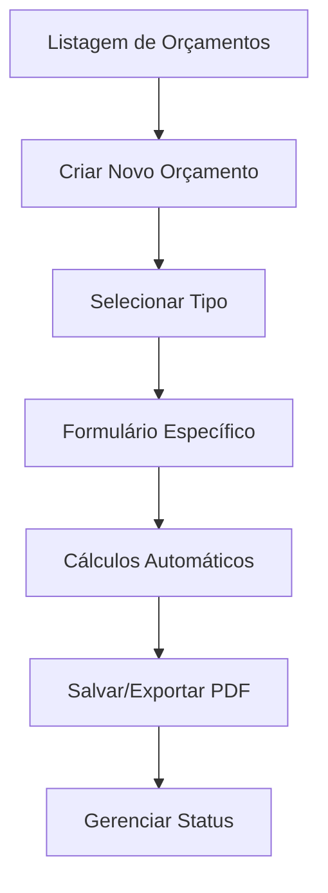

# Análise Técnica: Funcionalidade de Orçamentos - Adaptação para Filament PHP

## 1. VISÃO GERAL DA FUNCIONALIDADE

### Objetivo Principal
A funcionalidade de orçamentos permite criar, calcular e gerenciar propostas comerciais para serviços de transporte, considerando três tipos distintos: Prestador, Aumento de KM e Próprio Nova Rota.

### Tipos de Orçamentos Suportados
1. **Prestador**: Terceirização completa do serviço
2. **Aumento de KM**: Serviço adicional com base em quilometragem
3. **Próprio Nova Rota**: Serviço próprio com nova rota/estrutura

### Fluxo Geral no Filament


## 2. ARQUITETURA E ESTRUTURA NO FILAMENT

### 2.1 Modelos e Relacionamentos

#### Modelo Principal: Orcamento
```php
// app/Models/Orcamento.php
namespace App\Models;

use Illuminate\Database\Eloquent\Model;
use Illuminate\Database\Eloquent\Relations\HasMany;
use Illuminate\Database\Eloquent\Relations\BelongsTo;

class Orcamento extends Model
{
    protected $fillable = [
        'data_solicitacao',
        'centro_custo_id',
        'numero_orcamento',
        'nome_rota',
        'id_logcare',
        'cliente_omie_id',
        'cliente_nome',
        'horario',
        'frequencia_atendimento',
        'tipo_orcamento', // prestador, aumento_km, proprio_nova_rota
        'user_id',
        'data_orcamento',
        'valor_total',
        'valor_impostos',
        'valor_final',
        'status',
        'observacoes'
    ];

    protected $casts = [
        'data_solicitacao' => 'date',
        'data_orcamento' => 'date',
        'valor_total' => 'decimal:2',
        'valor_impostos' => 'decimal:2',
        'valor_final' => 'decimal:2',
        'observacoes' => 'array'
    ];

    public function prestadores(): HasMany
    {
        return $this->hasMany(OrcamentoPrestador::class);
    }

    public function aumentosKm(): HasMany
    {
        return $this->hasMany(OrcamentoAumentoKm::class);
    }

    public function rotasProprias(): HasMany
    {
        return $this->hasMany(OrcamentoProprioNovaRota::class);
    }

    public function centroCusto(): BelongsTo
    {
        return $this->belongsTo(CentroCusto::class);
    }

    public function user(): BelongsTo
    {
        return $this->belongsTo(User::class);
    }
}
```

#### Modelos Relacionados
```php
// app/Models/OrcamentoPrestador.php
class OrcamentoPrestador extends Model
{
    protected $fillable = [
        'orcamento_id',
        'fornecedor_omie_id',
        'fornecedor_nome',
        'valor_referencia',
        'qtd_dias',
        'custo_fornecedor',
        'lucro_percentual',
        'valor_lucro',
        'impostos_percentual',
        'valor_impostos',
        'valor_total',
        'grupo_imposto_id'
    ];

    public function orcamento(): BelongsTo
    {
        return $this->belongsTo(Orcamento::class);
    }

    public function grupoImposto(): BelongsTo
    {
        return $this->belongsTo(GrupoImposto::class);
    }
}
```

### 2.2 Estrutura de Resources no Filament

#### Resource Principal: OrcamentoResource
```php
// app/Filament/Resources/OrcamentoResource.php
namespace App\Filament\Resources;

use App\Filament\Resources\OrcamentoResource\Pages;
use App\Models\Orcamento;
use Filament\Forms;
use Filament\Forms\Form;
use Filament\Resources\Resource;
use Filament\Tables;
use Filament\Tables\Table;

class OrcamentoResource extends Resource
{
    protected static ?string $model = Orcamento::class;
    
    protected static ?string $navigationIcon = 'heroicon-o-calculator';
    
    protected static ?string $navigationLabel = 'Orçamentos';
    
    protected static ?string $modelLabel = 'Orçamento';
    
    protected static ?string $pluralModelLabel = 'Orçamentos';

    public static function form(Form $form): Form
    {
        return $form
            ->schema([
                Forms\Components\Section::make('Informações Básicas')
                    ->schema([
                        Forms\Components\Select::make('tipo_orcamento')
                            ->label('Tipo de Orçamento')
                            ->options([
                                'prestador' => 'Prestador',
                                'aumento_km' => 'Aumento de KM',
                                'proprio_nova_rota' => 'Próprio Nova Rota'
                            ])
                            ->required()
                            ->live()
                            ->afterStateUpdated(fn ($state, Forms\Set $set) => 
                                $set('tipo_orcamento_display', $state)
                            ),
                        
                        Forms\Components\TextInput::make('numero_orcamento')
                            ->label('Número do Orçamento')
                            ->disabled()
                            ->dehydrated()
                            ->default(fn () => self::generateNumeroOrcamento()),
                        
                        Forms\Components\DatePicker::make('data_solicitacao')
                            ->label('Data da Solicitação')
                            ->required()
                            ->default(now()),
                        
                        Forms\Components\Select::make('centro_custo_id')
                            ->label('Centro de Custo')
                            ->relationship('centroCusto', 'nome')
                            ->searchable()
                            ->preload()
                            ->required(),
                    ])
                    ->columns(2),
                
                Forms\Components\Section::make('Informações do Cliente')
                    ->schema([
                        Forms\Components\TextInput::make('cliente_nome')
                            ->label('Nome do Cliente')
                            ->required()
                            ->maxLength(255),
                        
                        Forms\Components\TextInput::make('id_logcare')
                            ->label('ID Logcare')
                            ->maxLength(50),
                        
                        Forms\Components\TextInput::make('nome_rota')
                            ->label('Nome da Rota')
                            ->required()
                            ->maxLength(255),
                        
                        Forms\Components\TextInput::make('horario')
                            ->label('Horário')
                            ->maxLength(50),
                        
                        Forms\Components\TextInput::make('frequencia_atendimento')
                            ->label('Frequência de Atendimento')
                            ->maxLength(100),
                    ])
                    ->columns(2),
                
                Forms\Components\Section::make('Valores')
                    ->schema([
                        Forms\Components\TextInput::make('valor_total')
                            ->label('Valor Total')
                            ->numeric()
                            ->prefix('R$')
                            ->disabled()
                            ->dehydrated(),
                        
                        Forms\Components\TextInput::make('valor_impostos')
                            ->label('Valor de Impostos')
                            ->numeric()
                            ->prefix('R$')
                            ->disabled()
                            ->dehydrated(),
                        
                        Forms\Components\TextInput::make('valor_final')
                            ->label('Valor Final')
                            ->numeric()
                            ->prefix('R$')
                            ->disabled()
                            ->dehydrated(),
                    ])
                    ->columns(3),
                
                Forms\Components\Section::make('Status')
                    ->schema([
                        Forms\Components\Select::make('status')
                            ->label('Status')
                            ->options([
                                'pendente' => 'Pendente',
                                'aprovado' => 'Aprovado',
                                'rejeitado' => 'Rejeitado',
                                'cancelado' => 'Cancelado'
                            ])
                            ->required()
                            ->default('pendente'),
                        
                        Forms\Components\DatePicker::make('data_orcamento')
                            ->label('Data do Orçamento')
                            ->disabled()
                            ->dehydrated(),
                    ])
                    ->columns(2),
                
                Forms\Components\Section::make('Observações')
                    ->schema([
                        Forms\Components\RichEditor::make('observacoes')
                            ->label('Observações')
                            ->columnSpanFull(),
                    ]),
            ]);
    }

    public static function table(Table $table): Table
    {
        return $table
            ->columns([
                Tables\Columns\TextColumn::make('numero_orcamento')
                    ->label('Número')
                    ->searchable()
                    ->sortable(),
                
                Tables\Columns\TextColumn::make('cliente_nome')
                    ->label('Cliente')
                    ->searchable()
                    ->limit(30),
                
                Tables\Columns\BadgeColumn::make('tipo_orcamento')
                    ->label('Tipo')
                    ->colors([
                        'primary' => 'prestador',
                        'warning' => 'aumento_km',
                        'success' => 'proprio_nova_rota',
                    ])
                    ->formatStateUsing(fn (string $state): string => match ($state) {
                        'prestador' => 'Prestador',
                        'aumento_km' => 'Aumento KM',
                        'proprio_nova_rota' => 'Próprio Nova Rota',
                    }),
                
                Tables\Columns\BadgeColumn::make('status')
                    ->label('Status')
                    ->colors([
                        'warning' => 'pendente',
                        'success' => 'aprovado',
                        'danger' => 'rejeitado',
                        'gray' => 'cancelado',
                    ])
                    ->formatStateUsing(fn (string $state): string => ucfirst($state)),
                
                Tables\Columns\TextColumn::make('valor_final')
                    ->label('Valor Final')
                    ->money('BRL')
                    ->sortable(),
                
                Tables\Columns\TextColumn::make('data_solicitacao')
                    ->label('Data Solicitação')
                    ->date('d/m/Y')
                    ->sortable(),
                
                Tables\Columns\TextColumn::make('user.name')
                    ->label('Criado por')
                    ->sortable(),
                
                Tables\Columns\TextColumn::make('created_at')
                    ->label('Criado em')
                    ->dateTime('d/m/Y H:i')
                    ->sortable()
                    ->toggleable(isToggledHiddenByDefault: true),
            ])
            ->filters([
                Tables\Filters\SelectFilter::make('tipo_orcamento')
                    ->label('Tipo de Orçamento')
                    ->options([
                        'prestador' => 'Prestador',
                        'aumento_km' => 'Aumento de KM',
                        'proprio_nova_rota' => 'Próprio Nova Rota'
                    ]),
                
                Tables\Filters\SelectFilter::make('status')
                    ->label('Status')
                    ->options([
                        'pendente' => 'Pendente',
                        'aprovado' => 'Aprovado',
                        'rejeitado' => 'Rejeitado',
                        'cancelado' => 'Cancelado'
                    ]),
                
                Tables\Filters\Filter::make('data_solicitacao')
                    ->form([
                        Forms\Components\DatePicker::make('de')
                            ->label('De'),
                        Forms\Components\DatePicker::make('ate')
                            ->label('Até'),
                    ])
                    ->query(function (Builder $query, array $data): Builder {
                        return $query
                            ->when(
                                $data['de'],
                                fn (Builder $query, $date): Builder => $query->whereDate('data_solicitacao', '>=', $date),
                            )
                            ->when(
                                $data['ate'],
                                fn (Builder $query, $date): Builder => $query->whereDate('data_solicitacao', '<=', $date),
                            );
                    }),
            ])
            ->actions([
                Tables\Actions\ActionGroup::make([
                    Tables\Actions\EditAction::make(),
                    Tables\Actions\ViewAction::make(),
                    Tables\Actions\Action::make('duplicar')
                        ->icon('heroicon-o-document-duplicate')
                        ->action(fn (Orcamento $record) => self::duplicarOrcamento($record))
                        ->requiresConfirmation(),
                    Tables\Actions\Action::make('pdf')
                        ->icon('heroicon-o-arrow-down-tray')
                        ->label('Exportar PDF')
                        ->action(fn (Orcamento $record) => self::exportarPdf($record)),
                    Tables\Actions\DeleteAction::make(),
                ]),
            ])
            ->bulkActions([
                Tables\Actions\BulkActionGroup::make([
                    Tables\Actions\DeleteBulkAction::make(),
                    Tables\Actions\BulkAction::make('exportar_pdf')
                        ->icon('heroicon-o-arrow-down-tray')
                        ->action(fn (Collection $records) => self::exportarPdfLote($records)),
                ]),
            ])
            ->defaultSort('created_at', 'desc');
    }

    public static function getRelations(): array
    {
        return [
            // Relações serão adicionadas baseado no tipo
        ];
    }

    public static function getPages(): array
    {
        return [
            'index' => Pages\ListOrcamentos::route('/'),
            'create' => Pages\CreateOrcamento::route('/create'),
            'edit' => Pages\EditOrcamento::route('/{record}/edit'),
            'view' => Pages\ViewOrcamento::route('/{record}'),
        ];
    }

    private static function generateNumeroOrcamento(): string
    {
        $lastOrcamento = Orcamento::orderBy('id', 'desc')->first();
        $nextId = $lastOrcamento ? $lastOrcamento->id + 1 : 1;
        return 'ORC-' . str_pad($nextId, 6, '0', STR_PAD_LEFT);
    }

    private static function duplicarOrcamento(Orcamento $orcamento): void
    {
        $novoOrcamento = $orcamento->replicate();
        $novoOrcamento->numero_orcamento = self::generateNumeroOrcamento();
        $novoOrcamento->status = 'pendente';
        $novoOrcamento->save();

        // Duplicar relacionamentos
        foreach ($orcamento->prestadores as $prestador) {
            $novoPrestador = $prestador->replicate();
            $novoPrestador->orcamento_id = $novoOrcamento->id;
            $novoPrestador->save();
        }

        foreach ($orcamento->aumentosKm as $aumento) {
            $novoAumento = $aumento->replicate();
            $novoAumento->orcamento_id = $novoOrcamento->id;
            $novoAumento->save();
        }

        foreach ($orcamento->rotasProprias as $rota) {
            $novoRota = $rota->replicate();
            $novoRota->orcamento_id = $novoOrcamento->id;
            $novoRota->save();
        }
    }

    private static function exportarPdf(Orcamento $orcamento): void
    {
        // Implementar exportação PDF
        // Usar dompdf ou similar
    }

    private static function exportarPdfLote(Collection $orcamentos): void
    {
        // Exportar múltiplos PDFs
    }
}
```

## 3. IMPLEMENTAÇÃO DOS TIPOS DE ORÇAMENTOS

### 3.1 Orçamento Prestador
```php
// app/Filament/Resources/OrcamentoResource/RelationManagers/PrestadoresRelationManager.php
namespace App\Filament\Resources\OrcamentoResource\RelationManagers;

use Filament\Forms;
use Filament\Forms\Form;
use Filament\Resources\RelationManagers\RelationManager;
use Filament\Tables;
use Filament\Tables\Table;
use Illuminate\Database\Eloquent\Builder;
use Illuminate\Database\Eloquent\Model;

class PrestadoresRelationManager extends RelationManager
{
    protected static string $relationship = 'prestadores';

    protected static ?string $title = 'Fornecedores/Prestadores';

    public function form(Form $form): Form
    {
        return $form
            ->schema([
                Forms\Components\Section::make('Informações do Fornecedor')
                    ->schema([
                        Forms\Components\TextInput::make('fornecedor_nome')
                            ->label('Nome do Fornecedor')
                            ->required()
                            ->maxLength(255),
                        
                        Forms\Components\TextInput::make('fornecedor_omie_id')
                            ->label('ID Omie do Fornecedor')
                            ->numeric(),
                        
                        Forms\Components\Select::make('grupo_imposto_id')
                            ->label('Grupo de Imposto')
                            ->relationship('grupoImposto', 'nome')
                            ->searchable()
                            ->preload()
                            ->required()
                            ->live()
                            ->afterStateUpdated(fn ($state, Forms\Set $set) => 
                                self::atualizarCalculos($set, $state)
                            ),
                    ])
                    ->columns(2),
                
                Forms\Components\Section::make('Valores')
                    ->schema([
                        Forms\Components\TextInput::make('valor_referencia')
                            ->label('Valor de Referência')
                            ->numeric()
                            ->prefix('R$')
                            ->required()
                            ->live(debounce: 500)
                            ->afterStateUpdated(fn ($state, Forms\Set $set) => 
                                self::calcularValores($set)
                            ),
                        
                        Forms\Components\TextInput::make('qtd_dias')
                            ->label('Quantidade de Dias')
                            ->numeric()
                            ->required()
                            ->default(1)
                            ->live(debounce: 500)
                            ->afterStateUpdated(fn ($state, Forms\Set $set) => 
                                self::calcularValores($set)
                            ),
                        
                        Forms\Components\TextInput::make('custo_fornecedor')
                            ->label('Custo do Fornecedor')
                            ->numeric()
                            ->prefix('R$')
                            ->disabled()
                            ->dehydrated(),
                        
                        Forms\Components\TextInput::make('lucro_percentual')
                            ->label('% de Lucro')
                            ->numeric()
                            ->suffix('%')
                            ->default(20)
                            ->live(debounce: 500)
                            ->afterStateUpdated(fn ($state, Forms\Set $set) => 
                                self::calcularValores($set)
                            ),
                        
                        Forms\Components\TextInput::make('valor_lucro')
                            ->label('Valor de Lucro')
                            ->numeric()
                            ->prefix('R$')
                            ->disabled()
                            ->dehydrated(),
                        
                        Forms\Components\TextInput::make('impostos_percentual')
                            ->label('% de Impostos')
                            ->numeric()
                            ->suffix('%')
                            ->disabled()
                            ->dehydrated(),
                        
                        Forms\Components\TextInput::make('valor_impostos')
                            ->label('Valor de Impostos')
                            ->numeric()
                            ->prefix('R$')
                            ->disabled()
                            ->dehydrated(),
                        
                        Forms\Components\TextInput::make('valor_total')
                            ->label('Valor Total')
                            ->numeric()
                            ->prefix('R$')
                            ->disabled()
                            ->dehydrated()
                            ->afterStateHydrated(fn ($state, Forms\Set $set) => 
                                self::calcularValores($set)
                            ),
                    ])
                    ->columns(4),
            ]);
    }

    public function table(Table $table): Table
    {
        return $table
            ->recordTitleAttribute('fornecedor_nome')
            ->columns([
                Tables\Columns\TextColumn::make('fornecedor_nome')
                    ->label('Fornecedor')
                    ->searchable()
                    ->sortable(),
                
                Tables\Columns\TextColumn::make('valor_referencia')
                    ->label('Valor Referência')
                    ->money('BRL')
                    ->sortable(),
                
                Tables\Columns\TextColumn::make('qtd_dias')
                    ->label('Dias')
                    ->sortable(),
                
                Tables\Columns\TextColumn::make('valor_total')
                    ->label('Valor Total')
                    ->money('BRL')
                    ->sortable(),
                
                Tables\Columns\TextColumn::make('lucro_percentual')
                    ->label('% Lucro')
                    ->formatStateUsing(fn ($state) => $state . '%'),
                
                Tables\Columns\TextColumn::make('grupoImposto.nome')
                    ->label('Grupo Imposto')
                    ->sortable(),
            ])
            ->filters([
                //
            ])
            ->headerActions([
                Tables\Actions\CreateAction::make(),
            ])
            ->actions([
                Tables\Actions\EditAction::make(),
                Tables\Actions\DeleteAction::make(),
            ])
            ->bulkActions([
                Tables\Actions\BulkActionGroup::make([
                    Tables\Actions\DeleteBulkAction::make(),
                ]),
            ]);
    }

    private static function calcularValores(Forms\Set $set): void
    {
        $valorReferencia = floatval($set('valor_referencia') ?? 0);
        $qtdDias = intval($set('qtd_dias') ?? 1);
        $lucroPercentual = floatval($set('lucro_percentual') ?? 0);
        $impostosPercentual = floatval($set('impostos_percentual') ?? 0);

        // Cálculo base
        $custoFornecedor = $valorReferencia * $qtdDias;
        $valorLucro = $custoFornecedor * ($lucroPercentual / 100);
        $valorImpostos = ($custoFornecedor + $valorLucro) * ($impostosPercentual / 100);
        $valorTotal = $custoFornecedor + $valorLucro + $valorImpostos;

        // Atualizar campos
        $set('custo_fornecedor', number_format($custoFornecedor, 2, '.', ''));
        $set('valor_lucro', number_format($valorLucro, 2, '.', ''));
        $set('valor_impostos', number_format($valorImpostos, 2, '.', ''));
        $set('valor_total', number_format($valorTotal, 2, '.', ''));
    }

    private static function atualizarCalculos(Forms\Set $set, $grupoImpostoId): void
    {
        if ($grupoImpostoId) {
            $grupoImposto = \App\Models\GrupoImposto::find($grupoImpostoId);
            if ($grupoImposto) {
                $set('impostos_percentual', $grupoImposto->percentual_total);
                self::calcularValores($set);
            }
        }
    }
}
```

### 3.2 Orçamento Aumento de KM
```php
// app/Filament/Resources/OrcamentoResource/RelationManagers/AumentosKmRelationManager.php
namespace App\Filament\Resources\OrcamentoResource\RelationManagers;

use Filament\Forms;
use Filament\Forms\Form;
use Filament\Resources\RelationManagers\RelationManager;
use Filament\Tables;
use Filament\Tables\Table;

class AumentosKmRelationManager extends RelationManager
{
    protected static string $relationship = 'aumentosKm';

    protected static ?string $title = 'Aumento de Quilometragem';

    public function form(Form $form): Form
    {
        return $form
            ->schema([
                Forms\Components\Section::make('Informações do Veículo')
                    ->schema([
                        Forms\Components\TextInput::make('modelo_veiculo')
                            ->label('Modelo do Veículo')
                            ->required()
                            ->maxLength(255),
                        
                        Forms\Components\TextInput::make('placa_veiculo')
                            ->label('Placa do Veículo')
                            ->required()
                            ->maxLength(20),
                        
                        Forms\Components\TextInput::make('km_por_litro')
                            ->label('KM por Litro')
                            ->numeric()
                            ->step(0.1)
                            ->required()
                            ->live(debounce: 500)
                            ->afterStateUpdated(fn ($state, Forms\Set $set) => 
                                self::calcularCombustivel($set)
                            ),
                        
                        Forms\Components\TextInput::make('valor_combustivel')
                            ->label('Valor do Combustível (por litro)')
                            ->numeric()
                            ->prefix('R$')
                            ->step(0.01)
                            ->required()
                            ->live(debounce: 500)
                            ->afterStateUpdated(fn ($state, Forms\Set $set) => 
                                self::calcularCombustivel($set)
                            ),
                    ])
                    ->columns(2),
                
                Forms\Components\Section::make('Quilometragem')
                    ->schema([
                        Forms\Components\TextInput::make('km_rodado')
                            ->label('KM Rodado')
                            ->numeric()
                            ->required()
                            ->live(debounce: 500)
                            ->afterStateUpdated(fn ($state, Forms\Set $set) => 
                                self::calcularCombustivel($set)
                            ),
                        
                        Forms\Components\TextInput::make('km_vazio')
                            ->label('KM Vazio')
                            ->numeric()
                            ->required()
                            ->live(debounce: 500)
                            ->afterStateUpdated(fn ($state, Forms\Set $set) => 
                                self::calcularCombustivel($set)
                            ),
                        
                        Forms\Components\TextInput::make('km_total')
                            ->label('KM Total')
                            ->numeric()
                            ->disabled()
                            ->dehydrated(),
                    ])
                    ->columns(3),
                
                Forms\Components\Section::make('Custos Adicionais')
                    ->schema([
                        Forms\Components\TextInput::make('valor_combustivel_total')
                            ->label('Total Combustível')
                            ->numeric()
                            ->prefix('R$')
                            ->disabled()
                            ->dehydrated(),
                        
                        Forms\Components\TextInput::make('horas_extras')
                            ->label('Horas Extras')
                            ->numeric()
                            ->step(0.5)
                            ->required()
                            ->live(debounce: 500)
                            ->afterStateUpdated(fn ($state, Forms\Set $set) => 
                                self::calcularTotal($set)
                            ),
                        
                        Forms\Components\TextInput::make('valor_hora_extra')
                            ->label('Valor Hora Extra')
                            ->numeric()
                            ->prefix('R$')
                            ->step(0.01)
                            ->required()
                            ->live(debounce: 500)
                            ->afterStateUpdated(fn ($state, Forms\Set $set) => 
                                self::calcularTotal($set)
                            ),
                        
                        Forms\Components\TextInput::make('valor_pedagio')
                            ->label('Valor Pedágio')
                            ->numeric()
                            ->prefix('R$')
                            ->step(0.01)
                            ->required()
                            ->live(debounce: 500)
                            ->afterStateUpdated(fn ($state, Forms\Set $set) => 
                                self::calcularTotal($set)
                            ),
                        
                        Forms\Components\Select::make('grupo_imposto_id')
                            ->label('Grupo de Imposto')
                            ->relationship('grupoImposto', 'nome')
                            ->searchable()
                            ->preload()
                            ->required()
                            ->live()
                            ->afterStateUpdated(fn ($state, Forms\Set $set) => 
                                self::calcularTotal($set)
                            ),
                    ])
                    ->columns(2),
                
                Forms\Components\Section::make('Totais')
                    ->schema([
                        Forms\Components\TextInput::make('valor_hora_extra_total')
                            ->label('Total Horas Extras')
                            ->numeric()
                            ->prefix('R$')
                            ->disabled()
                            ->dehydrated(),
                        
                        Forms\Components\TextInput::make('valor_subtotal')
                            ->label('Subtotal')
                            ->numeric()
                            ->prefix('R$')
                            ->disabled()
                            ->dehydrated(),
                        
                        Forms\Components\TextInput::make('impostos_percentual')
                            ->label('% Impostos')
                            ->numeric()
                            ->suffix('%')
                            ->disabled()
                            ->dehydrated(),
                        
                        Forms\Components\TextInput::make('valor_impostos')
                            ->label('Valor Impostos')
                            ->numeric()
                            ->prefix('R$')
                            ->disabled()
                            ->dehydrated(),
                        
                        Forms\Components\TextInput::make('valor_total')
                            ->label('Valor Total')
                            ->numeric()
                            ->prefix('R$')
                            ->disabled()
                            ->dehydrated()
                            ->afterStateHydrated(fn ($state, Forms\Set $set) => 
                                self::calcularTotal($set)
                            ),
                    ])
                    ->columns(3),
            ]);
    }

    public function table(Table $table): Table
    {
        return $table
            ->recordTitleAttribute('modelo_veiculo')
            ->columns([
                Tables\Columns\TextColumn::make('modelo_veiculo')
                    ->label('Veículo')
                    ->searchable()
                    ->sortable(),
                
                Tables\Columns\TextColumn::make('placa_veiculo')
                    ->label('Placa')
                    ->searchable()
                    ->sortable(),
                
                Tables\Columns\TextColumn::make('km_total')
                    ->label('KM Total')
                    ->sortable(),
                
                Tables\Columns\TextColumn::make('valor_combustivel_total')
                    ->label('Combustível')
                    ->money('BRL')
                    ->sortable(),
                
                Tables\Columns\TextColumn::make('valor_pedagio')
                    ->label('Pedágio')
                    ->money('BRL')
                    ->sortable(),
                
                Tables\Columns\TextColumn::make('valor_total')
                    ->label('Valor Total')
                    ->money('BRL')
                    ->sortable(),
            ])
            ->filters([
                //
            ])
            ->headerActions([
                Tables\Actions\CreateAction::make(),
            ])
            ->actions([
                Tables\Actions\EditAction::make(),
                Tables\Actions\DeleteAction::make(),
            ])
            ->bulkActions([
                Tables\Actions\BulkActionGroup::make([
                    Tables\Actions\DeleteBulkAction::make(),
                ]),
            ]);
    }

    private static function calcularCombustivel(Forms\Set $set): void
    {
        $kmRodado = floatval($set('km_rodado') ?? 0);
        $kmVazio = floatval($set('km_vazio') ?? 0);
        $kmPorLitro = floatval($set('km_por_litro') ?? 1);
        $valorCombustivel = floatval($set('valor_combustivel') ?? 0);

        $kmTotal = $kmRodado + $kmVazio;
        $litrosNecessarios = $kmTotal / $kmPorLitro;
        $valorCombustivelTotal = $litrosNecessarios * $valorCombustivel;

        $set('km_total', $kmTotal);
        $set('valor_combustivel_total', number_format($valorCombustivelTotal, 2, '.', ''));
        
        self::calcularTotal($set);
    }

    private static function calcularTotal(Forms\Set $set): void
    {
        $valorCombustivelTotal = floatval($set('valor_combustivel_total') ?? 0);
        $horasExtras = floatval($set('horas_extras') ?? 0);
        $valorHoraExtra = floatval($set('valor_hora_extra') ?? 0);
        $valorPedagio = floatval($set('valor_pedagio') ?? 0);
        $impostosPercentual = floatval($set('impostos_percentual') ?? 0);

        $valorHoraExtraTotal = $horasExtras * $valorHoraExtra;
        $valorSubtotal = $valorCombustivelTotal + $valorHoraExtraTotal + $valorPedagio;
        $valorImpostos = $valorSubtotal * ($impostosPercentual / 100);
        $valorTotal = $valorSubtotal + $valorImpostos;

        $set('valor_hora_extra_total', number_format($valorHoraExtraTotal, 2, '.', ''));
        $set('valor_subtotal', number_format($valorSubtotal, 2, '.', ''));
        $set('valor_impostos', number_format($valorImpostos, 2, '.', ''));
        $set('valor_total', number_format($valorTotal, 2, '.', ''));
    }
}
```

## 4. SISTEMA DE CÁLCULOS COM FORM EVENTS

### 4.1 Calculadora Service para Filament
```php
// app/Services/OrcamentoCalculatorService.php
namespace App\Services;

use App\Models\GrupoImposto;
use App\Models\Orcamento;
use App\Models\OrcamentoPrestador;
use App\Models\OrcamentoAumentoKm;
use App\Models\OrcamentoProprioNovaRota;

class OrcamentoCalculatorService
{
    public function calcularTotaisOrcamento(Orcamento $orcamento): void
    {
        $valorTotal = 0;
        $valorImpostos = 0;

        switch ($orcamento->tipo_orcamento) {
            case 'prestador':
                $totais = $this->calcularTotaisPrestador($orcamento);
                break;
            
            case 'aumento_km':
                $totais = $this->calcularTotaisAumentoKm($orcamento);
                break;
            
            case 'proprio_nova_rota':
                $totais = $this->calcularTotaisProprioNovaRota($orcamento);
                break;
            
            default:
                $totais = ['valor_total' => 0, 'valor_impostos' => 0];
        }

        $orcamento->update([
            'valor_total' => $totais['valor_total'],
            'valor_impostos' => $totais['valor_impostos'],
            'valor_final' => $totais['valor_total']
        ]);
    }

    private function calcularTotaisPrestador(Orcamento $orcamento): array
    {
        $valorTotal = 0;
        $valorImpostos = 0;

        foreach ($orcamento->prestadores as $prestador) {
            $valorTotal += $prestador->valor_total;
            $valorImpostos += $prestador->valor_impostos;
        }

        return [
            'valor_total' => $valorTotal,
            'valor_impostos' => $valorImpostos
        ];
    }

    private function calcularTotaisAumentoKm(Orcamento $orcamento): array
    {
        $valorTotal = 0;
        $valorImpostos = 0;

        foreach ($orcamento->aumentosKm as $aumento) {
            $valorTotal += $aumento->valor_total;
            $valorImpostos += $aumento->valor_impostos;
        }

        return [
            'valor_total' => $valorTotal,
            'valor_impostos' => $valorImpostos
        ];
    }

    private function calcularTotaisProprioNovaRota(Orcamento $orcamento): array
    {
        $valorTotal = 0;
        $valorImpostos = 0;

        foreach ($orcamento->rotasProprias as $rota) {
            $valorTotal += $rota->valor_total_geral;
            $valorImpostos += $rota->valor_impostos_total;
        }

        return [
            'valor_total' => $valorTotal,
            'valor_impostos' => $valorImpostos
        ];
    }

    public function calcularPrestador(array $dados): array
    {
        $valorReferencia = floatval($dados['valor_referencia'] ?? 0);
        $qtdDias = intval($dados['qtd_dias'] ?? 1);
        $lucroPercentual = floatval($dados['lucro_percentual'] ?? 0);
        $grupoImpostoId = $dados['grupo_imposto_id'] ?? null;

        // Obter percentual de impostos
        $impostosPercentual = 0;
        if ($grupoImpostoId) {
            $grupoImposto = GrupoImposto::find($grupoImpostoId);
            $impostosPercentual = $grupoImposto ? $grupoImposto->percentual_total : 0;
        }

        // Cálculos
        $custoFornecedor = $valorReferencia * $qtdDias;
        $valorLucro = $custoFornecedor * ($lucroPercentual / 100);
        $baseImpostos = $custoFornecedor + $valorLucro;
        $valorImpostos = $baseImpostos * ($impostosPercentual / 100);
        $valorTotal = $baseImpostos + $valorImpostos;

        return [
            'custo_fornecedor' => number_format($custoFornecedor, 2, '.', ''),
            'valor_lucro' => number_format($valorLucro, 2, '.', ''),
            'impostos_percentual' => $impostosPercentual,
            'valor_impostos' => number_format($valorImpostos, 2, '.', ''),
            'valor_total' => number_format($valorTotal, 2, '.', '')
        ];
    }

    public function calcularAumentoKm(array $dados): array
    {
        $kmRodado = floatval($dados['km_rodado'] ?? 0);
        $kmVazio = floatval($dados['km_vazio'] ?? 0);
        $kmPorLitro = floatval($dados['km_por_litro'] ?? 1);
        $valorCombustivel = floatval($dados['valor_combustivel'] ?? 0);
        $horasExtras = floatval($dados['horas_extras'] ?? 0);
        $valorHoraExtra = floatval($dados['valor_hora_extra'] ?? 0);
        $valorPedagio = floatval($dados['valor_pedagio'] ?? 0);
        $grupoImpostoId = $dados['grupo_imposto_id'] ?? null;

        // Cálculos básicos
        $kmTotal = $kmRodado + $kmVazio;
        $litrosNecessarios = $kmTotal / $kmPorLitro;
        $valorCombustivelTotal = $litrosNecessarios * $valorCombustivel;
        $valorHoraExtraTotal = $horasExtras * $valorHoraExtra;
        $valorSubtotal = $valorCombustivelTotal + $valorHoraExtraTotal + $valorPedagio;

        // Impostos
        $impostosPercentual = 0;
        if ($grupoImpostoId) {
            $grupoImposto = GrupoImposto::find($grupoImpostoId);
            $impostosPercentual = $grupoImposto ? $grupoImposto->percentual_total : 0;
        }

        $valorImpostos = $valorSubtotal * ($impostosPercentual / 100);
        $valorTotal = $valorSubtotal + $valorImpostos;

        return [
            'km_total' => $kmTotal,
            'valor_combustivel_total' => number_format($valorCombustivelTotal, 2, '.', ''),
            'valor_hora_extra_total' => number_format($valorHoraExtraTotal, 2, '.', ''),
            'valor_subtotal' => number_format($valorSubtotal, 2, '.', ''),
            'impostos_percentual' => $impostosPercentual,
            'valor_impostos' => number_format($valorImpostos, 2, '.', ''),
            'valor_total' => number_format($valorTotal, 2, '.', '')
        ];
    }
}
```

## 5. INTEGRAÇÕES E SERVIÇOS

### 5.1 Integração com Omie no Filament
```php
// app/Filament/Resources/OrcamentoResource/Forms/Components/OmieClientPicker.php
namespace App\Filament\Resources\OrcamentoResource\Forms\Components;

use Filament\Forms\Components\Select;
use App\Services\OmieService;

class OmieClientPicker extends Select
{
    protected function setUp(): void
    {
        parent::setUp();

        $this->label('Cliente Omie')
            ->placeholder('Digite para buscar clientes...')
            ->searchable()
            ->options(function (string $search) {
                $omieService = app(OmieService::class);
                $clientes = $omieService->buscarClientes($search);
                
                return collect($clientes)->mapWithKeys(function ($cliente) {
                    return [
                        $cliente['codigo_cliente_omie'] => 
                            $cliente['nome_fantasia'] . ' - ' . $cliente['cnpj_cpf']
                    ];
                })->toArray();
            })
            ->getOptionLabelsUsing(function (array $values): array {
                $omieService = app(OmieService::class);
                
                return collect($values)->mapWithKeys(function ($value) use ($omieService) {
                    $cliente = $omieService->buscarClientePorId($value);
                    return [
                        $value => $cliente['nome_fantasia'] ?? 'Cliente não encontrado'
                    ];
                })->toArray();
            })
            ->live()
            ->afterStateUpdated(function ($state, $set) {
                if ($state) {
                    $omieService = app(OmieService::class);
                    $cliente = $omieService->buscarClientePorId($state);
                    
                    if ($cliente) {
                        $set('cliente_nome', $cliente['nome_fantasia']);
                        $set('cliente_documento', $cliente['cnpj_cpf']);
                        $set('cliente_endereco', $cliente['endereco']);
                    }
                }
            });
    }
}
```

### 5.2 Service de Exportação PDF
```php
// app/Services/OrcamentoPdfService.php
namespace App\Services;

use App\Models\Orcamento;
use Barryvdh\DomPDF\Facade\Pdf;

class OrcamentoPdfService
{
    public function gerarPdf(Orcamento $orcamento): string
    {
        $dados = $this->prepararDadosPdf($orcamento);
        
        $pdf = Pdf::loadView('pdf.orcamento', $dados)
            ->setPaper('a4', 'portrait')
            ->setOptions([
                'isHtml5ParserEnabled' => true,
                'isRemoteEnabled' => true,
                'defaultFont' => 'sans-serif'
            ]);

        return $pdf->output();
    }

    private function prepararDadosPdf(Orcamento $orcamento): array
    {
        return [
            'orcamento' => $orcamento,
            'prestadores' => $orcamento->prestadores,
            'aumentosKm' => $orcamento->aumentosKm,
            'rotasProprias' => $orcamento->rotasProprias,
            'centroCusto' => $orcamento->centroCusto,
            'usuario' => $orcamento->user,
            'dataEmissao' => now()->format('d/m/Y H:i:s'),
            'logo' => public_path('images/logo.png')
        ];
    }

    public function gerarPdfLote(array $orcamentos): string
    {
        $pdfs = [];
        
        foreach ($orcamentos as $orcamento) {
            $pdfs[] = $this->gerarPdf($orcamento);
        }

        // Implementar merge de PDFs se necessário
        return $pdfs[0] ?? '';
    }
}
```

## 6. IMPLEMENTAÇÃO DE CACHE NO FILAMENT

### 6.1 Cache Service Adaptado
```php
// app/Services/OrcamentoCacheService.php
namespace App\Services;

use App\Models\Orcamento;
use Illuminate\Support\Facades\Cache;

class OrcamentoCacheService
{
    private const CACHE_PREFIX = 'orcamento_';
    private const CACHE_TTL_LIST = 300; // 5 minutos
    private const CACHE_TTL_RECORD = 1800; // 30 minutos
    private const CACHE_TTL_DASHBOARD = 600; // 10 minutos

    public function getOrcamentosList(array $filters = []): array
    {
        $cacheKey = self::CACHE_PREFIX . 'list_' . md5(json_encode($filters));
        
        return Cache::remember($cacheKey, self::CACHE_TTL_LIST, function () use ($filters) {
            $query = Orcamento::with(['centroCusto', 'user'])
                ->orderBy('created_at', 'desc');

            // Aplicar filtros
            if (!empty($filters['tipo_orcamento'])) {
                $query->where('tipo_orcamento', $filters['tipo_orcamento']);
            }

            if (!empty($filters['status'])) {
                $query->where('status', $filters['status']);
            }

            if (!empty($filters['data_inicio'])) {
                $query->whereDate('data_solicitacao', '>=', $filters['data_inicio']);
            }

            if (!empty($filters['data_fim'])) {
                $query->whereDate('data_solicitacao', '<=', $filters['data_fim']);
            }

            return $query->paginate(25)->toArray();
        });
    }

    public function getOrcamento(int $id): ?Orcamento
    {
        $cacheKey = self::CACHE_PREFIX . 'record_' . $id;
        
        return Cache::remember($cacheKey, self::CACHE_TTL_RECORD, function () use ($id) {
            return Orcamento::with([
                'prestadores.grupoImposto',
                'aumentosKm.grupoImposto',
                'rotasProprias.grupoImposto',
                'centroCusto',
                'user'
            ])->find($id);
        });
    }

    public function invalidateOrcamento(int $id): void
    {
        $cacheKey = self::CACHE_PREFIX . 'record_' . $id;
        Cache::forget($cacheKey);
        
        // Invalidar lista também
        $this->invalidateList();
    }

    public function invalidateList(): void
    {
        // Invalidar todos os caches de listagem
        Cache::flush(); // Ou usar tag-based caching
    }

    public function getDashboardData(): array
    {
        $cacheKey = self::CACHE_PREFIX . 'dashboard_' . date('Y-m-d');
        
        return Cache::remember($cacheKey, self::CACHE_TTL_DASHBOARD, function () {
            return [
                'total_orcamentos' => Orcamento::count(),
                'total_pendente' => Orcamento::where('status', 'pendente')->count(),
                'total_aprovado' => Orcamento::where('status', 'aprovado')->count(),
                'valor_total_mes' => Orcamento::whereMonth('created_at', now()->month)
                    ->sum('valor_final'),
                'orcamentos_recentes' => Orcamento::with('user')
                    ->orderBy('created_at', 'desc')
                    ->limit(10)
                    ->get()
                    ->toArray()
            ];
        });
    }
}
```

## 7. WIDGETS DE DASHBOARD

### 7.1 Dashboard Widget para Orçamentos
```php
// app/Filament/Widgets/OrcamentoStatsWidget.php
namespace App\Filament\Widgets;

use App\Models\Orcamento;
use Filament\Widgets\StatsOverviewWidget as BaseWidget;
use Filament\Widgets\StatsOverviewWidget\Stat;
use Illuminate\Support\Facades\DB;

class OrcamentoStatsWidget extends BaseWidget
{
    protected function getStats(): array
    {
        $totalOrcamentos = Orcamento::count();
        $orcamentosPendentes = Orcamento::where('status', 'pendente')->count();
        $valorTotalMes = Orcamento::whereMonth('created_at', now()->month)
            ->sum('valor_final');
        
        $orcamentosUltimos30Dias = Orcamento::where('created_at', '>=', now()->subDays(30))
            ->count();

        $percentualPendentes = $totalOrcamentos > 0 
            ? round(($orcamentosPendentes / $totalOrcamentos) * 100, 2) 
            : 0;

        return [
            Stat::make('Total de Orçamentos', $totalOrcamentos)
                ->description('Todos os orçamentos cadastrados')
                ->descriptionIcon('heroicon-o-document-text')
                ->color('primary'),

            Stat::make('Orçamentos Pendentes', $orcamentosPendentes)
                ->description($percentualPendentes . '% do total')
                ->descriptionIcon('heroicon-o-clock')
                ->color('warning'),

            Stat::make('Valor Total do Mês', 'R$ ' . number_format($valorTotalMes, 2, ',', '.'))
                ->description('Soma de todos os orçamentos do mês')
                ->descriptionIcon('heroicon-o-currency-dollar')
                ->color('success'),

            Stat::make('Orçamentos (30 dias)', $orcamentosUltimos30Dias)
                ->description('Últimos 30 dias')
                ->descriptionIcon('heroicon-o-calendar')
                ->color('info'),
        ];
    }

    protected function getColumns(): int
    {
        return 4;
    }
}
```

### 7.2 Chart Widget para Evolução de Orçamentos
```php
// app/Filament/Widgets/OrcamentoChartWidget.php
namespace App\Filament\Widgets;

use App\Models\Orcamento;
use Filament\Widgets\ChartWidget;
use Flowframe\Trend\Trend;
use Flowframe\Trend\TrendValue;

class OrcamentoChartWidget extends ChartWidget
{
    protected static ?string $heading = 'Evolução de Orçamentos';

    protected static ?string $pollingInterval = '60s';

    protected function getData(): array
    {
        $data = Trend::model(Orcamento::class)
            ->between(
                start: now()->startOfMonth(),
                end: now()->endOfMonth(),
            )
            ->perDay()
            ->count();

        return [
            'datasets' => [
                [
                    'label' => 'Orçamentos por Dia',
                    'data' => $data->map(fn (TrendValue $value) => $value->aggregate),
                    'borderColor' => '#3B82F6',
                    'backgroundColor' => 'rgba(59, 130, 246, 0.1)',
                    'fill' => true,
                    'tension' => 0.3,
                ],
            ],
            'labels' => $data->map(fn (TrendValue $value) => $value->date),
        ];
    }

    protected function getType(): string
    {
        return 'line';
    }

    protected function getOptions(): array
    {
        return [
            'plugins' => [
                'legend' => [
                    'display' => true,
                ],
            ],
            'scales' => [
                'y' => [
                    'beginAtZero' => true,
                ],
            ],
        ];
    }
}
```

## 8. CONFIGURAÇÕES DE PERMISSÕES E POLICIES

### 8.1 Policy para Orçamentos
```php
// app/Policies/OrcamentoPolicy.php
namespace App\Policies;

use App\Models\Orcamento;
use App\Models\User;
use Illuminate\Auth\Access\HandlesAuthorization;

class OrcamentoPolicy
{
    use HandlesAuthorization;

    public function viewAny(User $user): bool
    {
        return $user->can('view_orcamentos');
    }

    public function view(User $user, Orcamento $orcamento): bool
    {
        return $user->can('view_orcamentos') || 
               $user->id === $orcamento->user_id;
    }

    public function create(User $user): bool
    {
        return $user->can('create_orcamentos');
    }

    public function update(User $user, Orcamento $orcamento): bool
    {
        return $user->can('update_orcamentos') || 
               ($user->id === $orcamento->user_id && 
                in_array($orcamento->status, ['pendente']));
    }

    public function delete(User $user, Orcamento $orcamento): bool
    {
        return $user->can('delete_orcamentos') && 
               in_array($orcamento->status, ['pendente']);
    }

    public function duplicate(User $user, Orcamento $orcamento): bool
    {
        return $user->can('create_orcamentos');
    }

    public function exportPdf(User $user, Orcamento $orcamento): bool
    {
        return $user->can('export_orcamentos') || 
               $user->id === $orcamento->user_id;
    }
}
```

### 8.2 Registro de Policies no Resource
```php
// Em OrcamentoResource.php - adicionar:

public static function canViewAny(): bool
{
    return auth()->user()->can('view_orcamentos');
}

public static function canCreate(): bool
{
    return auth()->user()->can('create_orcamentos');
}

public static function canEdit($record): bool
{
    return auth()->user()->can('update_orcamentos') || 
           (auth()->id() === $record->user_id && 
            in_array($record->status, ['pendente']));
}

public static function canDelete($record): bool
{
    return auth()->user()->can('delete_orcamentos') && 
           in_array($record->status, ['pendente']);
}
```

## 9. IMPLEMENTAÇÃO PASSO A PASSO

### Fase 1: Estrutura Base (Semana 1)
1. Criar migrations para todas as tabelas
2. Implementar models com relacionamentos
3. Criar OrcamentoResource básico
4. Configurar navegação e permissões

### Fase 2: Tipos de Orçamento (Semana 2)
1. Implementar PrestadoresRelationManager
2. Implementar AumentosKmRelationManager  
3. Implementar RotasPropriasRelationManager
4. Adicionar cálculos automáticos

### Fase 3: Integrações (Semana 3)
1. Integrar OmieClientPicker
2. Implementar exportação PDF
3. Adicionar sistema de cache
4. Criar dashboard widgets

### Fase 4: Otimizações (Semana 4)
1. Implementar busca avançada
2. Adicionar filtros complexos
3. Otimizar queries com eager loading
4. Implementar relatórios

## 10. MELHORIAS E OPORTUNIDADES

### Aproveitando Recursos do Filament
1. **Form Wizard**: Dividir criação em etapas
2. **Repeater**: Para múltiplos itens dinâmicos
3. **Toggle Buttons**: Para status e seleções
4. **Section**: Organizar forms por categorias
5. **Tabs**: Separar informações por abas

### Funcionalidades Adicionais
1. **Templates de Orçamento**: Salvar modelos
2. **Comparador**: Comparar múltiplos orçamentos
3. **Notificações**: Alertas por email/Slack
4. **API REST**: Para integrações externas
5. **Orçamentos Recorrentes**: Repetição automática

### Otimizações de Performance
1. **Lazy Loading**: Carregar dados sob demanda
2. **Pagination**: Paginação server-side
3. **Indexed DB**: Índices em campos frequentes
4. **Queue Jobs**: Processamentos assíncronos
5. **CDN**: Assets estáticos em CDN

## 11. CONSIDERAÇÕES FINAIS

### Pontos de Atenção
1. **Migração de Dados**: Script para migrar dados antigos
2. **Treinamento**: Capacitar usuários no novo sistema
3. **Rollback**: Plano de rollback se necessário
4. **Performance**: Monitorar performance em produção
5. **Segurança**: Implementar rate limiting e validações

### Próximos Passos
1. Criar ambiente de staging para testes
2. Implementar testes automatizados
3. Documentar API para integrações
4. Criar manual do usuário
5. Estabelecer métricas de sucesso

Esta documentação fornece uma base sólida para implementar a funcionalidade completa de orçamentos no Filament PHP, mantendo todas as funcionalidades do sistema antigo enquanto moderniza a arquitetura e aproveita os recursos avançados do framework.