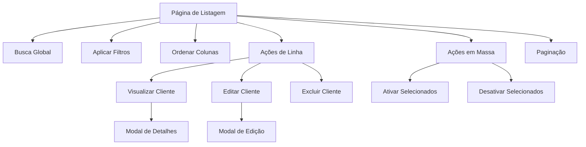

# Requisitos de Produto - Tabela de Clientes com Filament

## 1. Visão Geral do Produto

Sistema de gerenciamento de clientes integrado ao painel administrativo Filament, permitindo visualização, busca, filtros e ações sobre os dados dos clientes de forma eficiente e intuitiva.

O produto visa substituir a implementação atual de tabela de clientes por uma solução mais robusta usando os recursos nativos do Filament, mantendo a mesma fonte de dados mas oferecendo melhor experiência do usuário e funcionalidades avançadas.

## 2. Funcionalidades Principais

### 2.1 Papéis de Usuário

| Papel | Método de Registro | Permissões Principais |
|-------|-------------------|----------------------|
| Administrador | Acesso direto ao painel | Visualizar, criar, editar e excluir clientes |
| Usuário Comum | Login no sistema | Visualizar e buscar clientes |

### 2.2 Módulo de Funcionalidades

Nossos requisitos para a tabela de clientes consistem nas seguintes páginas principais:

1. **Página de Listagem de Clientes**: exibição em tabela, busca global, filtros, paginação, ações de linha e em massa.
2. **Modal de Visualização**: detalhes completos do cliente em modal.
3. **Modal de Edição**: formulário para editar dados do cliente.

### 2.3 Detalhes das Páginas

| Nome da Página | Nome do Módulo | Descrição da Funcionalidade |
|----------------|----------------|----------------------------|
| Listagem de Clientes | Tabela Principal | Exibir lista de clientes com colunas configuráveis, busca global, filtros por status e empresa, ordenação por colunas |
| Listagem de Clientes | Sistema de Busca | Buscar clientes por nome, email, empresa ou telefone em tempo real |
| Listagem de Clientes | Filtros Avançados | Filtrar por status (ativo/inativo), empresa, data de criação |
| Listagem de Clientes | Paginação | Navegar entre páginas com opções de 10, 25, 50 registros por página |
| Listagem de Clientes | Ações de Linha | Visualizar, editar e excluir cliente individual |
| Listagem de Clientes | Ações em Massa | Ativar/desativar múltiplos clientes selecionados |
| Modal de Visualização | Detalhes do Cliente | Mostrar informações completas do cliente em modal |
| Modal de Edição | Formulário de Edição | Editar dados do cliente com validação |

## 3. Processo Principal

### Fluxo do Administrador
1. Acessa a página de listagem de clientes
2. Visualiza a tabela com todos os clientes
3. Pode usar busca global para encontrar clientes específicos
4. Pode aplicar filtros para refinar a visualização
5. Pode ordenar por qualquer coluna clicável
6. Pode executar ações individuais (visualizar, editar, excluir)
7. Pode selecionar múltiplos clientes e executar ações em massa
8. Pode navegar entre páginas usando a paginação

### Fluxo do Usuário Comum
1. Acessa a página de listagem de clientes
2. Visualiza a tabela com clientes (sem ações de edição/exclusão)
3. Pode usar busca e filtros para encontrar informações
4. Pode visualizar detalhes dos clientes

## 4. Design da Interface do Usuário

### 4.1 Estilo de Design

- **Cores Primárias**: Azul (#3B82F6) e Cinza (#6B7280)
- **Cores Secundárias**: Verde (#10B981) para sucesso, Vermelho (#EF4444) para perigo
- **Estilo de Botões**: Arredondados com hover suave
- **Fonte**: Inter, tamanhos 14px (corpo), 16px (títulos), 12px (legendas)
- **Layout**: Baseado em cards com navegação superior
- **Ícones**: Heroicons com estilo outline

### 4.2 Visão Geral do Design das Páginas

| Nome da Página | Nome do Módulo | Elementos da UI |
|----------------|----------------|-----------------|
| Listagem de Clientes | Cabeçalho da Tabela | Título "Clientes", campo de busca global, botões de filtro, contador de registros |
| Listagem de Clientes | Colunas da Tabela | Avatar circular (40px), Nome com email como descrição, Empresa, Telefone, Status com ícone colorido, Data de criação |
| Listagem de Clientes | Filtros | Dropdown para status (Todos/Ativo/Inativo), Select searchable para empresa |
| Listagem de Clientes | Ações de Linha | Botões pequenos: Visualizar (ícone olho), Editar (ícone lápis), Excluir (ícone lixeira) |
| Listagem de Clientes | Ações em Massa | Checkbox para seleção, dropdown com ações: Ativar/Desativar selecionados |
| Listagem de Clientes | Paginação | Links numerados, botões Anterior/Próximo, select para registros por página |
| Modal de Visualização | Layout do Modal | Cabeçalho com nome do cliente, corpo com informações organizadas em grid 2 colunas |
| Modal de Edição | Formulário | Campos organizados em 2 colunas: Nome, Email, Empresa, Telefone, Status toggle |

### 4.3 Responsividade

O produto é desktop-first com adaptação para mobile. Em dispositivos móveis:
- Tabela se transforma em cards empilhados
- Filtros ficam em modal
- Ações de linha se tornam dropdown
- Paginação simplificada
- Touch-friendly com botões maiores

## 5. Especificações Técnicas

### 5.1 Fonte de Dados
- Utilizar a mesma função de recuperação de dados da tabela atual
- Manter compatibilidade com o modelo Eloquent existente
- Preservar relacionamentos e eager loading

### 5.2 Funcionalidades Obrigatórias
- Busca global em tempo real
- Filtros persistentes na sessão
- Ordenação por múltiplas colunas
- Paginação configurável
- Ações de linha com confirmação
- Ações em massa com feedback
- Responsividade completa
- Acessibilidade (ARIA labels, navegação por teclado)

### 5.3 Performance
- Lazy loading para relacionamentos
- Paginação server-side
- Cache de filtros aplicados
- Otimização de queries com índices

### 5.4 Validações
- Confirmação para ações destrutivas
- Validação de formulários em tempo real
- Feedback visual para ações executadas
- Tratamento de erros com mensagens claras

## 6. Critérios de Aceitação

### 6.1 Funcionalidade
- [ ] Tabela carrega dados corretamente usando a função existente
- [ ] Busca global funciona em todos os campos visíveis
- [ ] Filtros aplicam corretamente e persistem na sessão
- [ ] Ordenação funciona em todas as colunas marcadas como sortable
- [ ] Paginação navega corretamente entre páginas
- [ ] Ações de linha executam as operações corretas
- [ ] Ações em massa funcionam com múltiplos registros selecionados
- [ ] Modais abrem e fecham corretamente
- [ ] Formulários validam dados antes do envio

### 6.2 Performance
- [ ] Tabela carrega em menos de 2 segundos
- [ ] Busca responde em menos de 500ms
- [ ] Filtros aplicam em menos de 1 segundo
- [ ] Paginação navega instantaneamente

### 6.3 Usabilidade
- [ ] Interface é intuitiva e fácil de usar
- [ ] Feedback visual claro para todas as ações
- [ ] Responsividade funciona em dispositivos móveis
- [ ] Acessibilidade atende padrões WCAG 2.1

### 6.4 Compatibilidade
- [ ] Funciona em Chrome, Firefox, Safari e Edge
- [ ] Responsivo em tablets e smartphones
- [ ] Integra perfeitamente com o painel Filament existente
- [ ] Mantém consistência visual com o resto da aplicação