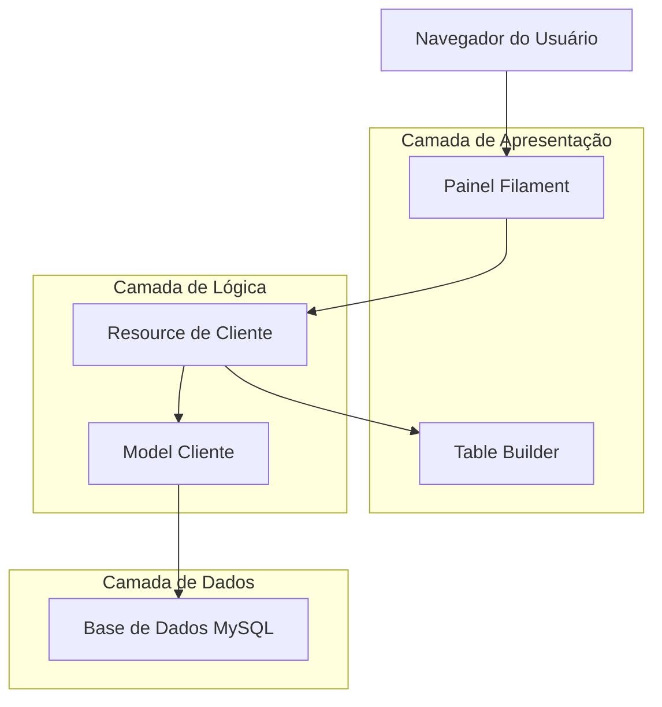
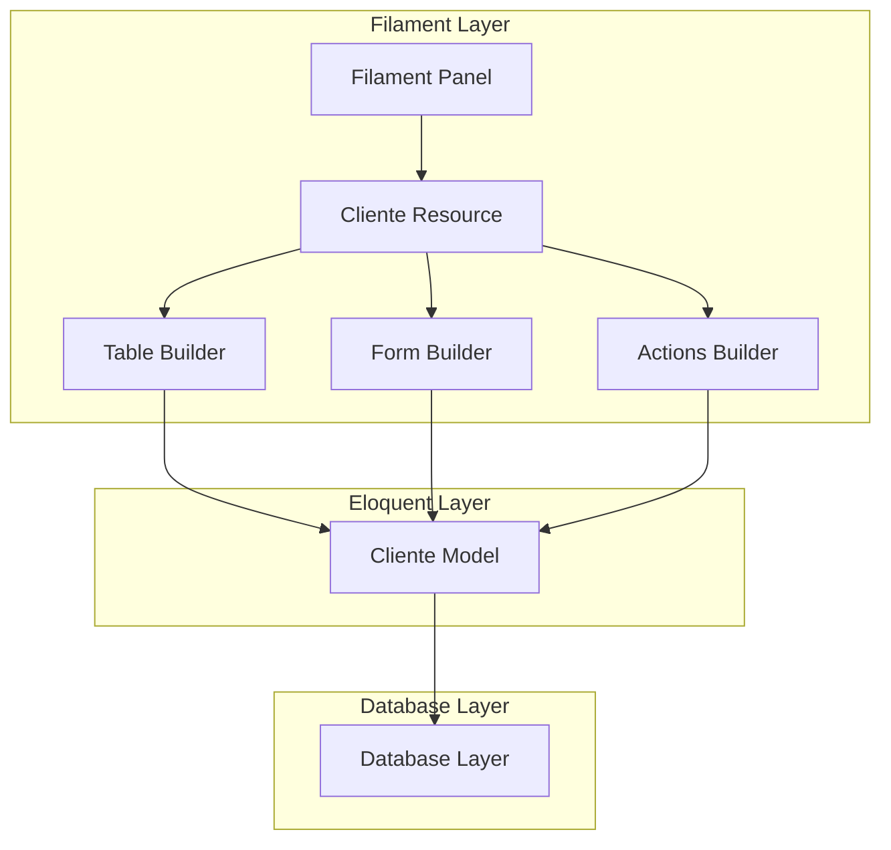
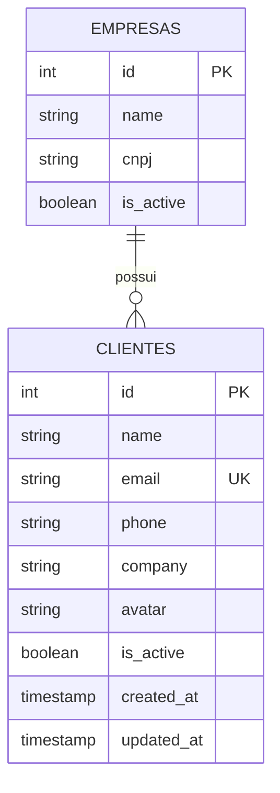

# Arquitetura Técnica - Tabela de Clientes com Filament

## 1. Design da Arquitetura



## 2. Descrição das Tecnologias

* Frontend: Filament v4 + Livewire v3 + Alpine.js + Tailwind CSS v4

* Backend: Laravel v11 + PHP 8.2

* Database: MySQL (via Eloquent ORM)

## 3. Definições de Rotas

| Rota                      | Propósito                                |
| ------------------------- | ---------------------------------------- |
| /admin/clientes           | Página principal de listagem de clientes |
| /admin/clientes/create    | Modal/página de criação de cliente       |
| /admin/clientes/{id}/edit | Modal/página de edição de cliente        |
| /admin/clientes/{id}      | Visualização de detalhes do cliente      |

## 4. Definições de API

### 4.1 API Principal do Filament

O Filament utiliza Livewire para comunicação entre frontend e backend, não requerendo APIs REST tradicionais.

**Ações da Tabela (via Livewire)**

Busca e Filtros

```php
// Método no Resource
public function table(Table $table): Table
{
    return $table
        ->query($this->getTableQuery())
        ->searchable()
        ->filters($this->getTableFilters());
}
```

Parâmetros de Busca:

| Nome do Parâmetro | Tipo   | Obrigatório | Descrição                       |
| ----------------- | ------ | ----------- | ------------------------------- |
| search            | string | false       | Termo de busca global           |
| filters           | array  | false       | Array de filtros aplicados      |
| sort              | string | false       | Campo para ordenação            |
| direction         | string | false       | Direção da ordenação (asc/desc) |

Resposta:

| Nome do Parâmetro | Tipo   | Descrição                    |
| ----------------- | ------ | ---------------------------- |
| data              | array  | Array de registros paginados |
| pagination        | object | Informações de paginação     |

### 4.2 Estrutura de Dados do Cliente

```typescript
interface Cliente {
    id: number;
    name: string;
    email: string;
    phone?: string;
    company?: string;
    avatar?: string;
    is_active: boolean;
    created_at: string;
    updated_at: string;
}

interface ClienteTableData {
    data: Cliente[];
    pagination: {
        current_page: number;
        last_page: number;
        per_page: number;
        total: number;
    };
    filters: {
        search?: string;
        is_active?: boolean;
        company?: string;
    };
    sort: {
        field: string;
        direction: 'asc' | 'desc';
    };
}
```

## 5. Arquitetura do Servidor



## 6. Modelo de Dados

### 6.1 Definição do Modelo de Dados



### 6.2 Linguagem de Definição de Dados

**Tabela de Clientes (clientes)**

```sql
-- Criar tabela (se não existir)
CREATE TABLE IF NOT EXISTS clientes (
    id BIGINT UNSIGNED AUTO_INCREMENT PRIMARY KEY,
    name VARCHAR(255) NOT NULL,
    email VARCHAR(255) UNIQUE NOT NULL,
    phone VARCHAR(20) NULL,
    company VARCHAR(255) NULL,
    avatar VARCHAR(500) NULL,
    is_active BOOLEAN DEFAULT TRUE,
    created_at TIMESTAMP NULL DEFAULT CURRENT_TIMESTAMP,
    updated_at TIMESTAMP NULL DEFAULT CURRENT_TIMESTAMP ON UPDATE CURRENT_TIMESTAMP
);

-- Criar índices para performance
CREATE INDEX idx_clientes_name ON clientes(name);
CREATE INDEX idx_clientes_email ON clientes(email);
CREATE INDEX idx_clientes_company ON clientes(company);
CREATE INDEX idx_clientes_is_active ON clientes(is_active);
CREATE INDEX idx_clientes_created_at ON clientes(created_at DESC);

-- Dados iniciais (exemplo)
INSERT INTO clientes (name, email, phone, company, is_active) VALUES
('João Silva', 'joao@exemplo.com', '(11) 99999-9999', 'Empresa A', TRUE),
('Maria Santos', 'maria@exemplo.com', '(11) 88888-8888', 'Empresa B', TRUE),
('Pedro Oliveira', 'pedro@exemplo.com', '(11) 77777-7777', 'Empresa A', FALSE),
('Ana Costa', 'ana@exemplo.com', '(11) 66666-6666', 'Empresa C', TRUE);
```

## 7. Implementação do Resource

### 7.1 Estrutura do Cliente Resource

```php
<?php

namespace App\Filament\Resources;

use App\Filament\Resources\ClienteResource\Pages;
use App\Models\Cliente;
use Filament\Forms;
use Filament\Forms\Form;
use Filament\Resources\Resource;
use Filament\Tables;
use Filament\Tables\Table;

class ClienteResource extends Resource
{
    protected static ?string $model = Cliente::class;
    protected static ?string $navigationIcon = 'heroicon-o-users';
    protected static ?string $navigationLabel = 'Clientes';
    protected static ?string $modelLabel = 'Cliente';
    protected static ?string $pluralModelLabel = 'Clientes';

    public static function table(Table $table): Table
    {
        return $table
            ->columns([
                Tables\Columns\ImageColumn::make('avatar')
                    ->label('Foto')
                    ->circular()
                    ->size(40)
                    ->defaultImageUrl('/images/default-avatar.png'),
                
                Tables\Columns\TextColumn::make('name')
                    ->label('Nome')
                    ->searchable()
                    ->sortable()
                    ->description(fn ($record) => $record->email),
                
                Tables\Columns\TextColumn::make('company')
                    ->label('Empresa')
                    ->searchable()
                    ->sortable()
                    ->toggleable(),
                
                Tables\Columns\TextColumn::make('phone')
                    ->label('Telefone')
                    ->searchable()
                    ->toggleable(),
                
                Tables\Columns\IconColumn::make('is_active')
                    ->label('Status')
                    ->boolean()
                    ->trueIcon('heroicon-o-check-badge')
                    ->falseIcon('heroicon-o-x-mark')
                    ->trueColor('success')
                    ->falseColor('danger'),
                
                Tables\Columns\TextColumn::make('created_at')
                    ->label('Criado em')
                    ->dateTime('d/m/Y H:i')
                    ->sortable()
                    ->toggleable(isToggledHiddenByDefault: true),
            ])
            ->filters([
                Tables\Filters\TernaryFilter::make('is_active')
                    ->label('Status')
                    ->placeholder('Todos')
                    ->trueLabel('Ativo')
                    ->falseLabel('Inativo'),
                
                Tables\Filters\SelectFilter::make('company')
                    ->label('Empresa')
                    ->options(fn () => Cliente::distinct()->pluck('company', 'company'))
                    ->searchable(),
            ])
            ->actions([
                Tables\Actions\ViewAction::make()
                    ->label('Visualizar'),
                Tables\Actions\EditAction::make()
                    ->label('Editar'),
                Tables\Actions\DeleteAction::make()
                    ->label('Excluir')
                    ->requiresConfirmation(),
            ])
            ->bulkActions([
                Tables\Actions\BulkAction::make('activate')
                    ->label('Ativar Selecionados')
                    ->icon('heroicon-o-check')
                    ->requiresConfirmation()
                    ->action(fn ($records) => $records->each->update(['is_active' => true]))
                    ->deselectRecordsAfterCompletion(),
                
                Tables\Actions\BulkAction::make('deactivate')
                    ->label('Desativar Selecionados')
                    ->icon('heroicon-o-x-mark')
                    ->requiresConfirmation()
                    ->action(fn ($records) => $records->each->update(['is_active' => false]))
                    ->deselectRecordsAfterCompletion(),
                
                Tables\Actions\DeleteBulkAction::make()
                    ->label('Excluir Selecionados'),
            ])
            ->defaultSort('created_at', 'desc')
            ->paginated([10, 25, 50])
            ->searchable()
            ->persistFiltersInSession()
            ->persistSortInSession()
            ->persistSearchInSession();
    }

    public static function form(Form $form): Form
    {
        return $form
            ->schema([
                Forms\Components\Section::make('Informações Pessoais')
                    ->schema([
                        Forms\Components\TextInput::make('name')
                            ->label('Nome')
                            ->required()
                            ->maxLength(255),
                        
                        Forms\Components\TextInput::make('email')
                            ->label('Email')
                            ->email()
                            ->required()
                            ->unique(ignoreRecord: true)
                            ->maxLength(255),
                        
                        Forms\Components\TextInput::make('phone')
                            ->label('Telefone')
                            ->tel()
                            ->maxLength(20),
                        
                        Forms\Components\FileUpload::make('avatar')
                            ->label('Foto')
                            ->image()
                            ->avatar()
                            ->directory('avatars'),
                    ])
                    ->columns(2),
                
                Forms\Components\Section::make('Informações Profissionais')
                    ->schema([
                        Forms\Components\TextInput::make('company')
                            ->label('Empresa')
                            ->maxLength(255),
                        
                        Forms\Components\Toggle::make('is_active')
                            ->label('Ativo')
                            ->default(true),
                    ])
                    ->columns(2),
            ]);
    }

    public static function getPages(): array
    {
        return [
            'index' => Pages\ListClientes::route('/'),
            'create' => Pages\CreateCliente::route('/create'),
            'view' => Pages\ViewCliente::route('/{record}'),
            'edit' => Pages\EditCliente::route('/{record}/edit'),
        ];
    }
}
```

### 7.2 Model do Cliente

```php
<?php

namespace App\Models;

use Illuminate\Database\Eloquent\Factories\HasFactory;
use Illuminate\Database\Eloquent\Model;
use Illuminate\Database\Eloquent\SoftDeletes;

class Cliente extends Model
{
    use HasFactory, SoftDeletes;

    protected $fillable = [
        'name',
        'email',
        'phone',
        'company',
        'avatar',
        'is_active',
    ];

    protected $casts = [
        'is_active' => 'boolean',
        'created_at' => 'datetime',
        'updated_at' => 'datetime',
    ];

    // Scopes para filtros
    public function scopeActive($query)
    {
        return $query->where('is_active', true);
    }

    public function scopeInactive($query)
    {
        return $query->where('is_active', false);
    }

    public function scopeByCompany($query, $company)
    {
        return $query->where('company', $company);
    }

    // Accessors
    public function getAvatarUrlAttribute()
    {
        return $this->avatar 
            ? asset('storage/' . $this->avatar)
            : asset('images/default-avatar.png');
    }
}
```

## 8. Configurações de Performance

### 8.1 Otimizações de Query

```php
// No Resource, otimizar queries
protected function getTableQuery(): Builder
{
    return parent::getTableQuery()
        ->select(['id', 'name', 'email', 'phone', 'company', 'avatar', 'is_active', 'created_at'])
        ->when(request('tableSearch'), function ($query, $search) {
            $query->where(function ($q) use ($search) {
                $q->where('name', 'like', "%{$search}%")
                  ->orWhere('email', 'like', "%{$search}%")
                  ->orWhere('company', 'like', "%{$search}%")
                  ->orWhere('phone', 'like', "%{$search}%");
            });
        });
}
```

### 8.2 Cache de Filtros

```php
// Configuração de cache para opções de filtros
Tables\Filters\SelectFilter::make('company')
    ->options(function () {
        return Cache::remember('cliente_companies', 3600, function () {
            return Cliente::distinct()
                ->whereNotNull('company')
                ->pluck('company', 'company');
        });
    })
    ->searchable();
```

## 9. Testes e Validação

### 9.1 Testes Unitários

```php
// Teste do Model
public function test_cliente_can_be_created()
{
    $cliente = Cliente::factory()->create([
        'name' => 'João Silva',
        'email' => 'joao@teste.com',
        'is_active' => true,
    ]);

    $this->assertDatabaseHas('clientes', [
        'name' => 'João Silva',
        'email' => 'joao@teste.com',
        'is_active' => true,
    ]);
}
```

### 9.2 Testes de Feature

```php
// Teste do Resource
public function test_admin_can_view_clientes_table()
{
    $admin = User::factory()->create();
    Cliente::factory()->count(5)->create();

    $this->actingAs($admin)
        ->get('/admin/clientes')
        ->assertSuccessful()
        ->assertSee('Clientes');
}
```

## 10. Deployment e Configuração

### 10.1 Variáveis de Ambiente

```env
# Configurações específicas para a tabela de clientes
FILAMENT_CLIENTE_PAGINATION_DEFAULT=25
FILAMENT_CLIENTE_CACHE_FILTERS=true
FILAMENT_CLIENTE_ENABLE_BULK_ACTIONS=true
```

### 10.2 Comandos de Setup

```bash
# Publicar configurações do Filament
php artisan vendor:publish --tag=filament-config

# Executar migrações
php artisan migrate

# Limpar cache
php artisan cache:clear
php artisan config:clear
php artisan view:clear

# Otimizar para produção
php artisan optimize
```

Esta arquitetura técnica fornece uma base sólida para implementar a tabela de clientes usando Filament, mantendo performance, escalabilidade e facilidade de manutenção.
