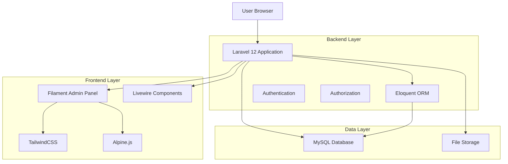
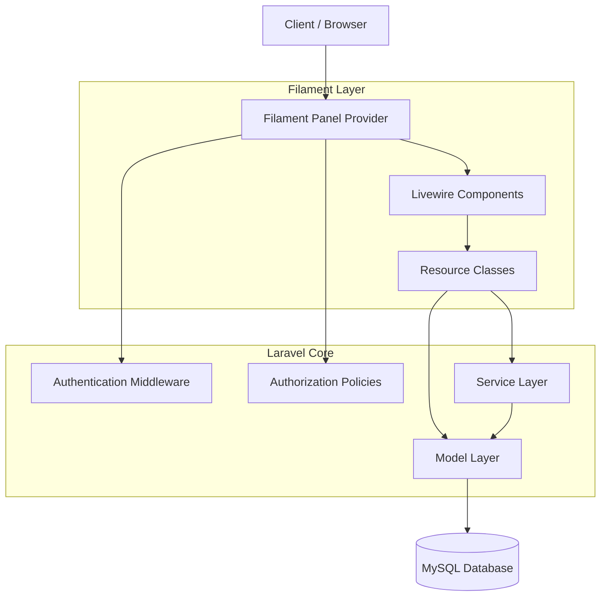
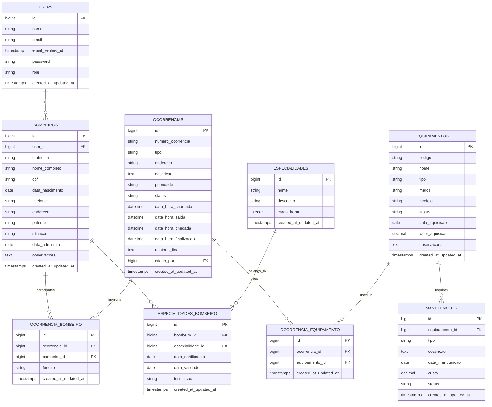

# Sistema OBM - Documento de Arquitetura Técnica

## 1. Architecture design



## 2. Technology Description

- **Frontend:** Filament PHP v3.x + Livewire v3.x + TailwindCSS v3.x + Alpine.js
- **Backend:** Laravel 12 + Eloquent ORM
- **Database:** MySQL 8.0
- **Authentication:** Laravel Sanctum + Filament Auth
- **File Storage:** Laravel Storage (local/cloud)
- **Testing:** Pest PHP v4.x

## 3. Route definitions

| Route | Purpose |
|-------|---------|
| /admin | Painel administrativo Filament, dashboard principal |
| /admin/login | Página de login do sistema administrativo |
| /admin/bombeiros | Gestão completa de bombeiros (CRUD) |
| /admin/ocorrencias | Gestão de ocorrências e emergências |
| /admin/equipamentos | Inventário e controle de equipamentos |
| /admin/relatorios | Geração e visualização de relatórios |
| /admin/configuracoes | Configurações do sistema e parâmetros |
| /admin/usuarios | Gestão de usuários e permissões |

## 4. API definitions

### 4.1 Core API

**Autenticação de usuários**
```
POST /admin/login
```

Request:
| Param Name| Param Type  | isRequired  | Description |
|-----------|-------------|-------------|-------------|
| email     | string      | true        | Email do usuário |
| password  | string      | true        | Senha do usuário |

Response:
| Param Name| Param Type  | Description |
|-----------|-------------|-------------|
| success   | boolean     | Status da autenticação |
| user      | object      | Dados do usuário autenticado |
| redirect  | string      | URL de redirecionamento |

**Gestão de Ocorrências**
```
POST /admin/ocorrencias
```

Request:
| Param Name| Param Type  | isRequired  | Description |
|-----------|-------------|-------------|-------------|
| tipo      | string      | true        | Tipo da ocorrência (incendio, resgate, emergencia_medica) |
| endereco  | string      | true        | Endereço da ocorrência |
| descricao | text        | true        | Descrição detalhada da ocorrência |
| prioridade| string      | true        | Nível de prioridade (baixa, media, alta, critica) |
| bombeiros | array       | false       | IDs dos bombeiros designados |

Response:
| Param Name| Param Type  | Description |
|-----------|-------------|-------------|
| id        | integer     | ID da ocorrência criada |
| status    | string      | Status atual da ocorrência |
| created_at| datetime    | Data/hora de criação |

Example:
```json
{
  "tipo": "incendio",
  "endereco": "Rua das Flores, 123 - Centro",
  "descricao": "Incêndio em residência com possíveis vítimas",
  "prioridade": "alta",
  "bombeiros": [1, 5, 8]
}
```

## 5. Server architecture diagram



## 6. Data model

### 6.1 Data model definition



### 6.2 Data Definition Language

**Tabela de Usuários (users)**
```sql
-- Tabela já existe no Laravel, apenas adicionar campo role
ALTER TABLE users ADD COLUMN role VARCHAR(50) DEFAULT 'soldado' AFTER email_verified_at;
```

**Tabela de Bombeiros (bombeiros)**
```sql
CREATE TABLE bombeiros (
    id BIGINT UNSIGNED AUTO_INCREMENT PRIMARY KEY,
    user_id BIGINT UNSIGNED NOT NULL,
    matricula VARCHAR(20) UNIQUE NOT NULL,
    nome_completo VARCHAR(255) NOT NULL,
    cpf VARCHAR(14) UNIQUE NOT NULL,
    data_nascimento DATE NOT NULL,
    telefone VARCHAR(20),
    endereco TEXT,
    patente VARCHAR(50) NOT NULL,
    situacao ENUM('ativo', 'inativo', 'licenca', 'aposentado') DEFAULT 'ativo',
    data_admissao DATE NOT NULL,
    observacoes TEXT,
    created_at TIMESTAMP DEFAULT CURRENT_TIMESTAMP,
    updated_at TIMESTAMP DEFAULT CURRENT_TIMESTAMP ON UPDATE CURRENT_TIMESTAMP,
    FOREIGN KEY (user_id) REFERENCES users(id) ON DELETE CASCADE
);

CREATE INDEX idx_bombeiros_matricula ON bombeiros(matricula);
CREATE INDEX idx_bombeiros_patente ON bombeiros(patente);
CREATE INDEX idx_bombeiros_situacao ON bombeiros(situacao);
```

**Tabela de Ocorrências (ocorrencias)**
```sql
CREATE TABLE ocorrencias (
    id BIGINT UNSIGNED AUTO_INCREMENT PRIMARY KEY,
    numero_ocorrencia VARCHAR(20) UNIQUE NOT NULL,
    tipo ENUM('incendio', 'resgate', 'emergencia_medica', 'acidente_transito', 'vazamento', 'outros') NOT NULL,
    endereco TEXT NOT NULL,
    descricao TEXT NOT NULL,
    prioridade ENUM('baixa', 'media', 'alta', 'critica') NOT NULL,
    status ENUM('aberta', 'em_andamento', 'finalizada', 'cancelada') DEFAULT 'aberta',
    data_hora_chamada DATETIME NOT NULL,
    data_hora_saida DATETIME,
    data_hora_chegada DATETIME,
    data_hora_finalizacao DATETIME,
    relatorio_final TEXT,
    criado_por BIGINT UNSIGNED NOT NULL,
    created_at TIMESTAMP DEFAULT CURRENT_TIMESTAMP,
    updated_at TIMESTAMP DEFAULT CURRENT_TIMESTAMP ON UPDATE CURRENT_TIMESTAMP,
    FOREIGN KEY (criado_por) REFERENCES users(id)
);

CREATE INDEX idx_ocorrencias_numero ON ocorrencias(numero_ocorrencia);
CREATE INDEX idx_ocorrencias_tipo ON ocorrencias(tipo);
CREATE INDEX idx_ocorrencias_status ON ocorrencias(status);
CREATE INDEX idx_ocorrencias_data_chamada ON ocorrencias(data_hora_chamada);
```

**Tabela de Equipamentos (equipamentos)**
```sql
CREATE TABLE equipamentos (
    id BIGINT UNSIGNED AUTO_INCREMENT PRIMARY KEY,
    codigo VARCHAR(20) UNIQUE NOT NULL,
    nome VARCHAR(255) NOT NULL,
    tipo ENUM('viatura', 'epi', 'ferramenta', 'comunicacao', 'outros') NOT NULL,
    marca VARCHAR(100),
    modelo VARCHAR(100),
    status ENUM('disponivel', 'em_uso', 'manutencao', 'inativo') DEFAULT 'disponivel',
    data_aquisicao DATE,
    valor_aquisicao DECIMAL(10,2),
    observacoes TEXT,
    created_at TIMESTAMP DEFAULT CURRENT_TIMESTAMP,
    updated_at TIMESTAMP DEFAULT CURRENT_TIMESTAMP ON UPDATE CURRENT_TIMESTAMP
);

CREATE INDEX idx_equipamentos_codigo ON equipamentos(codigo);
CREATE INDEX idx_equipamentos_tipo ON equipamentos(tipo);
CREATE INDEX idx_equipamentos_status ON equipamentos(status);
```

**Dados Iniciais**
```sql
-- Inserir tipos de especialidades padrão
INSERT INTO especialidades (nome, descricao, carga_horaria) VALUES
('Combate a Incêndio', 'Especialização em combate e prevenção de incêndios', 120),
('Resgate em Altura', 'Técnicas de resgate em locais elevados', 80),
('Emergências Médicas', 'Primeiros socorros e atendimento pré-hospitalar', 100),
('Resgate Aquático', 'Salvamento em ambientes aquáticos', 60),
('Materiais Perigosos', 'Manuseio e contenção de materiais perigosos', 90);

-- Inserir patentes padrão
INSERT INTO bombeiros (user_id, matricula, nome_completo, cpf, data_nascimento, patente, data_admissao) VALUES
(1, 'CBM001', 'Comandante Silva', '123.456.789-00', '1975-05-15', 'Coronel', '2000-01-15');
```