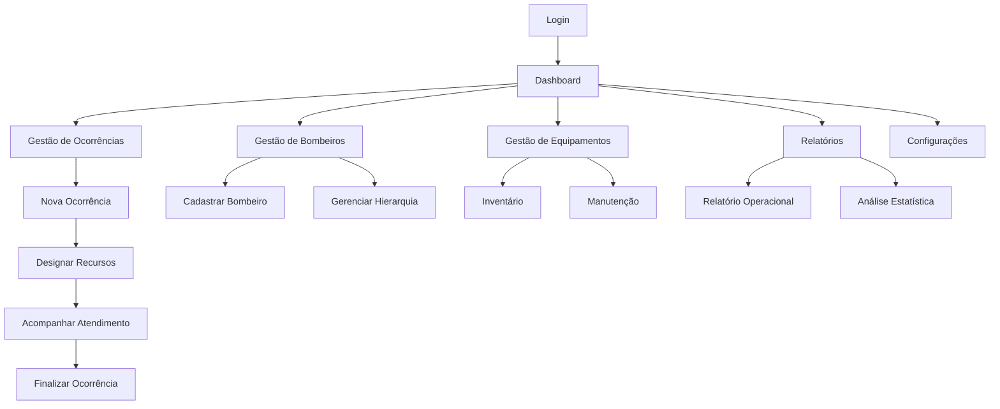

# Sistema OBM - Documento de Requisitos do Produto

## 1. Product Overview

Sistema de gestão integrado para Ordem de Bombeiros Militares, desenvolvido para otimizar operações de emergência, controle de recursos e administração de pessoal.
O sistema centraliza informações críticas de bombeiros, ocorrências e equipamentos, proporcionando maior eficiência operacional e tomada de decisões baseada em dados.
Destinado a comandos de bombeiros que buscam modernizar seus processos administrativos e operacionais através de uma plataforma digital robusta.

## 2. Core Features

### 2.1 User Roles

| Role | Registration Method | Core Permissions |
|------|---------------------|------------------|
| Comandante | Criação manual pelo sistema | Acesso total ao sistema, gestão de usuários, relatórios estratégicos |
| Oficial | Convite do Comandante | Gestão de ocorrências, equipamentos, relatórios operacionais |
| Sargento | Convite de Oficial/Comandante | Registro de ocorrências, consulta de equipamentos, relatórios básicos |
| Soldado | Convite de superior hierárquico | Consulta de informações básicas, registro de atividades |

### 2.2 Feature Module

Nosso sistema OBM consiste nas seguintes páginas principais:

1. **Dashboard**: painel de controle principal, estatísticas em tempo real, alertas de sistema, resumo de ocorrências ativas.
2. **Gestão de Bombeiros**: cadastro completo de pessoal, hierarquia militar, histórico de serviço, especialidades.
3. **Gestão de Ocorrências**: registro de emergências, classificação por tipo, status de atendimento, relatórios de ocorrência.
4. **Gestão de Equipamentos**: inventário de veículos, equipamentos de segurança, manutenção preventiva, disponibilidade.
5. **Relatórios**: relatórios operacionais, estatísticas de desempenho, análises de tendências, exportação de dados.
6. **Configurações**: parâmetros do sistema, tipos de ocorrência, configurações de usuário, backup de dados.

### 2.3 Page Details

| Page Name | Module Name | Feature description |
|-----------|-------------|---------------------|
| Dashboard | Painel Principal | Exibir estatísticas em tempo real de ocorrências ativas, bombeiros em serviço, equipamentos disponíveis |
| Dashboard | Alertas e Notificações | Mostrar alertas críticos, notificações de manutenção, avisos de sistema |
| Dashboard | Resumo Operacional | Apresentar gráficos de desempenho mensal, comparativos anuais, indicadores-chave |
| Gestão de Bombeiros | Cadastro de Pessoal | Criar, editar, visualizar perfis completos com dados pessoais, militares e profissionais |
| Gestão de Bombeiros | Hierarquia Militar | Definir patentes, estrutura de comando, subordinação, histórico de promoções |
| Gestão de Bombeiros | Especialidades | Registrar certificações, cursos, especialidades técnicas, validade de certificados |
| Gestão de Ocorrências | Registro de Emergências | Criar novos registros com localização, tipo, gravidade, recursos necessários |
| Gestão de Ocorrências | Classificação e Status | Categorizar por tipo (incêndio, resgate, emergência médica), atualizar status em tempo real |
| Gestão de Ocorrências | Histórico e Relatórios | Consultar ocorrências passadas, gerar relatórios detalhados, análise de padrões |
| Gestão de Equipamentos | Inventário de Veículos | Cadastrar viaturas, status operacional, localização atual, histórico de uso |
| Gestão de Equipamentos | Equipamentos de Segurança | Controlar EPIs, equipamentos especializados, validade, distribuição |
| Gestão de Equipamentos | Manutenção Preventiva | Agendar manutenções, registrar serviços, controlar custos, alertas de vencimento |
| Relatórios | Relatórios Operacionais | Gerar relatórios de produtividade, tempo de resposta, eficiência operacional |
| Relatórios | Análises Estatísticas | Criar gráficos de tendências, comparativos regionais, análise de sazonalidade |
| Relatórios | Exportação de Dados | Exportar dados em PDF, Excel, CSV para análises externas e prestação de contas |
| Configurações | Parâmetros do Sistema | Configurar tipos de ocorrência, níveis de prioridade, parâmetros operacionais |
| Configurações | Gestão de Usuários | Criar contas, definir permissões, gerenciar acessos, auditoria de ações |
| Login | Autenticação | Realizar login seguro com validação de credenciais e controle de sessão |
| Registro | Cadastro de Usuários | Permitir registro de novos usuários mediante aprovação hierárquica |

## 3. Core Process

### Fluxo Principal do Sistema

**Fluxo Operacional de Emergência:**
1. Recebimento de chamada de emergência
2. Registro da ocorrência no sistema com classificação
3. Designação de equipe e equipamentos disponíveis
4. Acompanhamento em tempo real do atendimento
5. Finalização com relatório detalhado

**Fluxo Administrativo:**
1. Login no sistema com validação de hierarquia
2. Acesso ao dashboard com informações relevantes ao nível do usuário
3. Execução de tarefas conforme permissões (registro, consulta, gestão)
4. Geração de relatórios para tomada de decisão

## 4. User Interface Design

### 4.1 Design Style

- **Cores Primárias:** Vermelho bombeiro (#DC2626), Azul marinho (#1E3A8A)
- **Cores Secundárias:** Cinza escuro (#374151), Branco (#FFFFFF), Verde sucesso (#059669)
- **Estilo de Botões:** Arredondados com sombra sutil, efeito hover suave
- **Fonte:** Inter (tamanhos: 14px padrão, 16px títulos, 12px legendas)
- **Layout:** Design limpo baseado em cards, navegação lateral fixa, breadcrumbs
- **Ícones:** Heroicons com estilo outline, ícones específicos para bombeiros (capacete, viatura, mangueira)

### 4.2 Page Design Overview

| Page Name | Module Name | UI Elements |
|-----------|-------------|-------------|
| Dashboard | Painel Principal | Cards com estatísticas, gráficos coloridos (Chart.js), layout em grid responsivo 3x2 |
| Dashboard | Alertas | Notificações em toast vermelho/amarelo, ícones de alerta, botões de ação rápida |
| Gestão de Bombeiros | Cadastro | Formulário em duas colunas, upload de foto, campos organizados por seções |
| Gestão de Bombeiros | Hierarquia | Organograma visual, cards de patente com cores distintivas, drag-and-drop |
| Gestão de Ocorrências | Registro | Modal de criação rápida, mapa integrado, campos obrigatórios destacados |
| Gestão de Ocorrências | Lista | Tabela com filtros avançados, status coloridos, ações em dropdown |
| Gestão de Equipamentos | Inventário | Cards de equipamentos com fotos, status visual (verde/vermelho), busca inteligente |
| Relatórios | Visualização | Gráficos interativos, filtros de data, botões de exportação destacados |

### 4.3 Responsiveness

O sistema é desenvolvido com abordagem mobile-first, garantindo total responsividade em tablets e smartphones. A navegação lateral se transforma em menu hambúrguer em telas menores, e os cards se reorganizam em layout de coluna única. Otimizado para touch interaction com botões de tamanho adequado e gestos intuitivos para operações em campo.